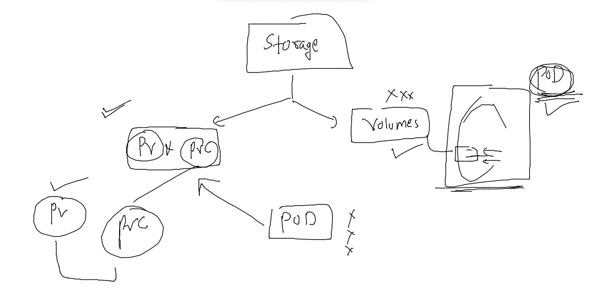
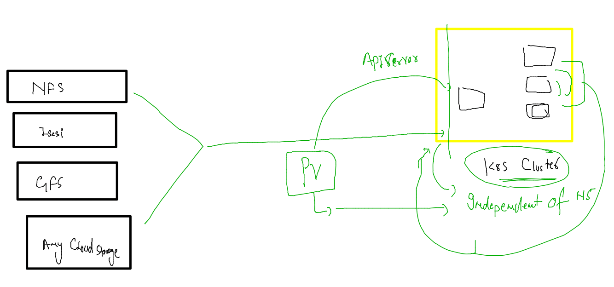
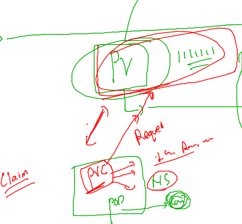
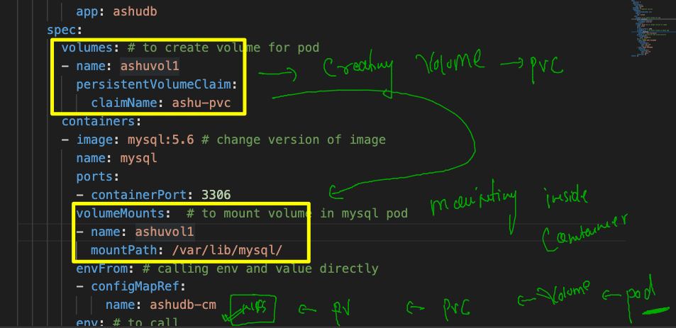

## Training plan 


### clean namespace data 

```
[ashu@docker-server images]$ kubectl  delete all --all
pod "ashuwebapp-7d9ff7df76-2fcp9" deleted
pod "ashuwebapp-7d9ff7df76-nfxpl" deleted
pod "ashuwebapp-7d9ff7df76-qr676" deleted
service "ashu-local-lb" deleted
deployment.apps "ashuwebapp" deleted
horizontalpodautoscaler.autoscaling "ashuwebapp" deleted

```

###

```
[ashu@docker-server images]$ kubectl  delete  cm,secret  --all
configmap "ashucm" deleted
configmap "kube-root-ca.crt" deleted
secret "ashu-sec" deleted
secret "ashuapp-sec" deleted
```

## deploy database --

### creating configmap 

```
apiVersion: v1
kind: ConfigMap
metadata:
  creationTimestamp: null
  name: ashudb-cm
data:
  MYSQL_USER: oracle
  MYSQL_DATABASE: mydb 

```

### creating secret to store info 

```
kubectl  create  secret  generic  db-cred  --from-literal  rootpw="Cisco@12345" --from-literal  upass="Docker@123456"  --dry-run=client -o yaml  >dbsecret.yaml


```

### deployment file 

```
apiVersion: apps/v1
kind: Deployment
metadata:
  creationTimestamp: null
  labels:
    app: ashudb
  name: ashudb # name of deployment 
spec:
  replicas: 1
  selector:
    matchLabels:
      app: ashudb
  strategy: {}
  template: # template section 
    metadata:
      creationTimestamp: null
      labels:
        app: ashudb
    spec:
      containers:
      - image: mysql
        name: mysql
        ports:
        - containerPort: 3306
        envFrom: # calling env and value directly 
        - configMapRef:
            name: ashudb-cm 
        env: # to call 
        - name: MYSQL_ROOT_PASSWORD
          valueFrom:
            secretKeyRef:
              name: db-cred
              key: rootpw
        - name: MYSQL_PASSWORD 
          valueFrom:
            secretKeyRef:
              name: db-cred
              key: upass 
        resources: {}
status: {}

```

### lets deploy it 

```
[ashu@docker-server multi-tier-app]$ kubectl  apply -f . 
deployment.apps/ashudb created
configmap/ashudb-cm configured
secret/db-cred configured
[ashu@docker-server multi-tier-app]$ kubectl  get  cm 
NAME               DATA   AGE
ashudb-cm          2      7m20s
kube-root-ca.crt   1      40m
[ashu@docker-server multi-tier-app]$ kubectl  get  secret
NAME      TYPE     DATA   AGE
db-cred   Opaque   2      7m23s
[ashu@docker-server multi-tier-app]$ kubectl  get  deploy 
NAME     READY   UP-TO-DATE   AVAILABLE   AGE
ashudb   1/1     1            1           4m53s
[ashu@docker-server multi-tier-app]$ kubectl  get  rs
NAME                DESIRED   CURRENT   READY   AGE
ashudb-779f468cfd   1         1         1       4m58s
[ashu@docker-server multi-tier-app]$ kubectl  get  po
NAME                      READY   STATUS    RESTARTS   AGE
ashudb-779f468cfd-2qv8d   1/1     Running   0          5m1s
```

### undertstanding storage in k8s 



### Understanding PV 



```
apiVersion: v1
kind: PersistentVolume
metadata:
  name: ashu-pv
spec:
  capacity:
    storage: 2Gi # 1 to 5 Gi
  accessModes:
    - ReadWriteMany # any node can access for read/write purpose 
  storageClassName: manual # we are manualy creating pv 
  nfs:
    server: 172.31.0.11
    path: "/data/ashu/db/"
```

### creating pv 

```
[ashu@docker-server multi-tier-app]$ kubectl apply -f pv.yaml 
persistentvolume/ashu-pv created
[ashu@docker-server multi-tier-app]$ kubectl get pv
NAME       CAPACITY   ACCESS MODES   RECLAIM POLICY   STATUS      CLAIM   STORAGECLASS   REASON   AGE
asad-pv    2Gi        RWX            Retain           Available           manual                  90s
ashu-pv    2Gi        RWX            Retain           Available           manual                  16s
champ-pv   1Gi        RWX            Retain           Available           manual                  10s
reddy-pv   2Gi        RWX            Retain           Available           manual                  78s
[ashu@docker-server multi-tier-app]$ 

```

### PVC 



```
apiVersion: v1
kind: PersistentVolumeClaim
metadata:
  name: ashu-pvc
spec:
  accessModes:
    - ReadWriteMany
  storageClassName: manual 
  resources:
    requests:
      storage: 1Gi 
```

### deploy pvc 

```
[ashu@docker-server multi-tier-app]$ kubectl apply -f  ashupvc.yaml 
persistentvolumeclaim/ashu-pvc created
[ashu@docker-server multi-tier-app]$ kubectl get pvc
NAME       STATUS   VOLUME     CAPACITY   ACCESS MODES   STORAGECLASS   AGE
ashu-pvc   Bound    champ-pv   1Gi        RWX            manual         14s
[ashu@docker-server multi-tier-app]$ 
```

### using pvc 



### sharing 

```
apiVersion: apps/v1
kind: Deployment
metadata:
  creationTimestamp: null
  labels:
    app: ashudb
  name: ashudb # name of deployment 
spec:
  replicas: 1
  selector:
    matchLabels:
      app: ashudb
  strategy: {}
  template: # template section 
    metadata:
      creationTimestamp: null
      labels:
        app: ashudb
    spec:
      volumes: # to create volume for pod 
      - name: ashuvol1 
        persistentVolumeClaim:
          claimName: ashu-pvc
      containers:
      - image: mysql:5.6 # change version of image 
        name: mysql
        ports:
        - containerPort: 3306
        volumeMounts:  # to mount volume in mysql pod 
        - name: ashuvol1
          mountPath: /var/lib/mysql/ 
        envFrom: # calling env and value directly 
        - configMapRef:
            name: ashudb-cm 
        env: # to call 
        - name: MYSQL_ROOT_PASSWORD
          valueFrom:
            secretKeyRef:
              name: db-cred
              key: rootpw
        - name: MYSQL_PASSWORD 
          valueFrom:
            secretKeyRef:
              name: db-cred
              key: upass 
        resources: {}
status: {}

```

### redeploying 

```
[ashu@docker-server multi-tier-app]$ kubectl replace -f ashudb.yaml  --force 
deployment.apps "ashudb" deleted
deployment.apps/ashudb replaced
[ashu@docker-server multi-tier-app]$ kubectl  get  po 
NAME                      READY   STATUS              RESTARTS   AGE
ashudb-789689f45f-bcx2s   0/1     ContainerCreating   0          5s
[ashu@docker-server multi-tier-app]$ kubectl  get  po 
NAME                      READY   STATUS    RESTARTS   AGE
ashudb-789689f45f-bcx2s   1/1     Running   0          9s
```

### checking databases 

```
[ashu@docker-server ~]$ kubectl  get po 
NAME                      READY   STATUS    RESTARTS   AGE
ashudb-789689f45f-bcx2s   1/1     Running   0          6m46s
[ashu@docker-server ~]$ kubectl  exec -it  ashudb-789689f45f-bcx2s  -- bash 
root@ashudb-789689f45f-bcx2s:/# mysql -u root -p 
Enter password: 
Welcome to the MySQL monitor.  Commands end with ; or \g.
Your MySQL connection id is 1
Server version: 5.6.51 MySQL Community Server (GPL)

Copyright (c) 2000, 2021, Oracle and/or its affiliates. All rights reserved.

Oracle is a registered trademark of Oracle Corporation and/or its
affiliates. Other names may be trademarks of their respective
owners.

Type 'help;' or '\h' for help. Type '\c' to clear the current input statement.

mysql> show databases; 
+--------------------+
| Database           |
+--------------------+
| information_schema |
| ashudb             |
| mysql              |
| performance_schema |
+--------------------+
4 rows in set (0.01 sec)

mysql> exit;
Bye
root@ashudb-789689f45f-bcx2s:/# exit
exit

```


