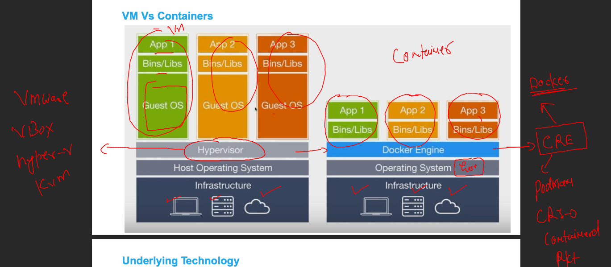
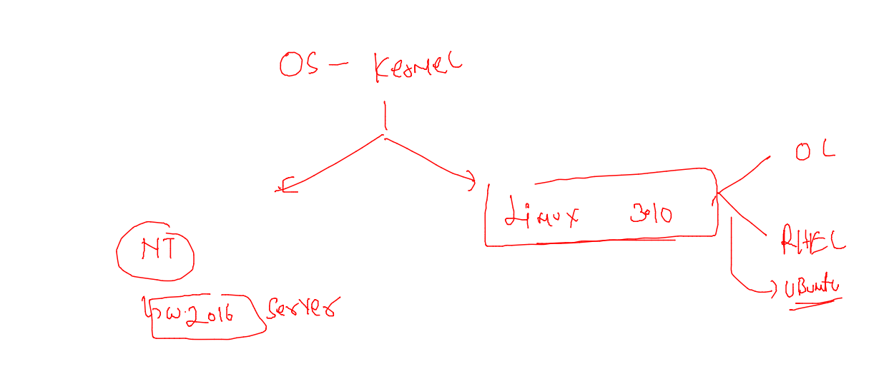
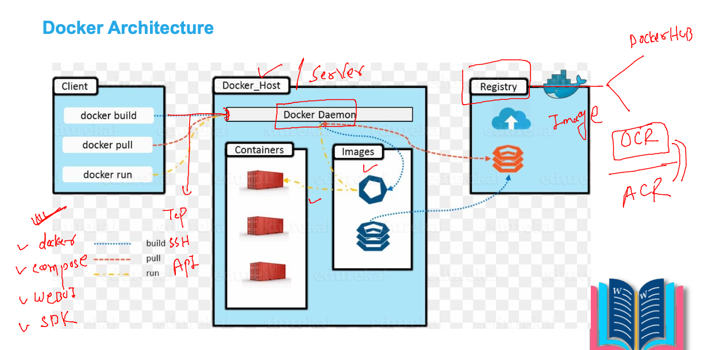
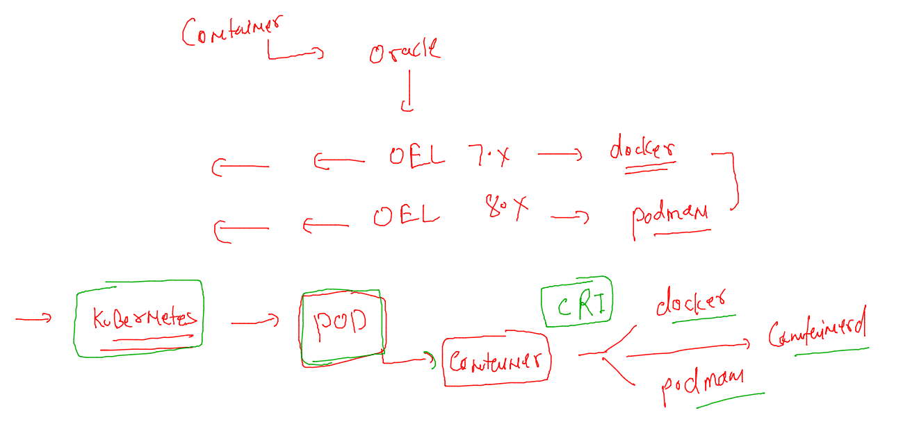

## Training plan 


### VM vs containers 



### OS kernel support



### Docker architecture 



### oracle support for CRE 



### Installing docker in OL 7.9 

### checking things 

```
[root@docker-server ~]# rpm -q docker 
package docker is not installed
[root@docker-server ~]# rpm -qa  |   grep  -i  docker 
[root@docker-server ~]# 
[root@docker-server ~]# cat /etc/os-release 
NAME="Oracle Linux Server"
VERSION="7.9"
ID="ol"
ID_LIKE="fedora"
VARIANT="Server"
VARIANT_ID="server"
VERSION_ID="7.9"
PRETTY_NAME="Oracle Linux Server 7.9"
ANSI_COLOR="0;31"
CPE_NAME="cpe:/o:oracle:linux:7:9:server"
HOME_URL="https://linux.oracle.com/"
BUG_REPORT_URL="https://bugzilla.oracle.com/"
```

### install docker 

```
 yum install docker-engine docker-cli  
Failed to set locale, defaulting to C
Loaded plugins: langpacks, ulninfo
ol7_MySQL80                                                                                              | 3.0 kB  00:00:00     
ol7_MySQL80_connectors_community                                                                         | 2.9 kB  00:00:00     
ol7_MySQL80_tools_community                                                                              | 2.9 kB  00:00:00     
ol7_UEKR6                                                                                                | 3.0 kB  00:00:00     
ol7_addons                                                                                               | 3.0 kB  00:00:00     
ol7_ksplice                       
```

### starting docker service 

```
[root@docker-server ~]# systemctl status docker 
● docker.service - Docker Application Container Engine
   Loaded: loaded (/usr/lib/systemd/system/docker.service; disabled; vendor preset: disabled)
   Active: inactive (dead)
     Docs: https://docs.docker.com
[root@docker-server ~]# systemctl start   docker 
[root@docker-server ~]# systemctl status docker 
● docker.service - Docker Application Container Engine
   Loaded: loaded (/usr/lib/systemd/system/docker.service; disabled; vendor preset: disabled)
   Active: active (running) since Mon 2022-07-04 05:06:46 GMT; 1s ago
     Docs: https://docs.docker.com
 Main PID: 11682 (dockerd)
    Tasks: 10
   Memory: 32.3M
   CGroup: /system.slice/docker.service
           └─11682 /usr/bin/dockerd -H fd:// --containerd=/run/containerd/containerd.sock

Jul 04 05:06:46 docker-server dockerd[11682]: time="2022-07-04T05:06:46.168575369Z" level=warning msg="Your kernel does...eight"
Jul 04 05:06:46 docker-server dockerd[11682]: time="2022-07-04T05:06:46.168602971Z" level=warning msg="Your kernel does...evice"
Jul 04 05:06:46 docker-server dockerd[11682]: time="2022-07-04T05:06:46.168939850Z" level=info msg="Loading containers: start."
Jul 04 05:06:46 docker-server dockerd[11682]: time="2022-07-04T05:06:46.382854273Z" level=info msg="Default bridge (doc...dress"
Jul 04 05:06:46 docker-server dockerd[11682]: time="2022-07-04T05:06:46.501425558Z" level=info msg="Loading containers: done."
Jul 04 05:06:46 docker-server dockerd[11682]: time="2022-07-04T05:06:46.510313197Z" level=warning msg="Not using native...erlay2
Jul 04 05:06:46 docker-server dockerd[11682]: time="2022-07-04T05:06:46.510469282Z" level=info msg="Docker daemon" comm....11-ol
Jul 04 05:06:46 docker-server dockerd[11682]: time="2022-07-04T05:06:46.510581696Z" level=info msg="Daemon has complete...ation"
Jul 04 05:06:46 docker-server dockerd[11682]: time="2022-07-04T05:06:46.538289934Z" level=info msg="API listen on /var/....sock"
Jul 04 05:06:46 docker-server systemd[1]: Started Docker Application Container Engine.
Hint: Some lines were ellipsized, use -l to show in full.
[root@docker-server ~]# systemctl enable  docker 
Created symlink from /etc/systemd/system/multi-user.target.wants/docker.service to /usr/lib/systemd/system/docker.service.
[root@docker-server ~]# 

```

### giving access to non root users 

### creating multiple users 

```
for  i in  ashu  arvind asad gaurav jijin krishna  manjunath natarajan reddy narayan pradeep ramesh rohit   shankar vinod 
do useradd $i
echo "Docker@123456"  |  passwd $i --stdin 
done 
```

### giving access 

```
[root@docker-server ~]# for  i  in  `ls /home`
> do
> usermod -aG docker $i
> done
[root@docker-server ~]# 
```

### single user 

```
usermod -aG docker <username>
```

### in Vscode terminal 

```
[ashu@docker-server ~]$ whoami
ashu
[ashu@docker-server ~]$ docker  version 
Client: Docker Engine - Community
 Version:           19.03.11-ol
 API version:       1.40
 Go version:        go1.16.2
 Git commit:        9bb540d
 Built:             Fri Jul 23 01:33:55 2021
 OS/Arch:           linux/amd64
 Experimental:      false

Server: Docker Engine - Community
 Engine:
  Version:          19.03.11-ol
  API version:      1.40 (minimum version 1.12)
  Go version:       go1.16.2
  Git commit:       9bb540d
  Built:            Fri Jul 23 01:32:08 2021
```


