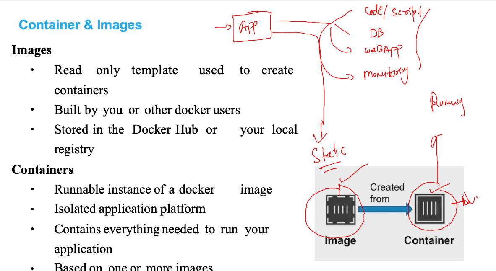
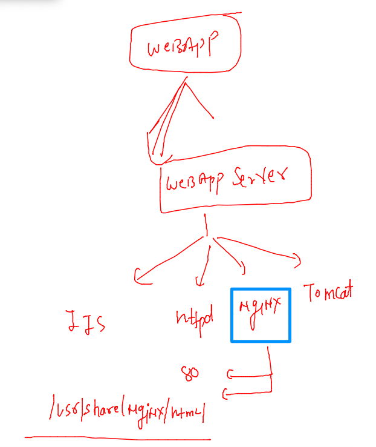
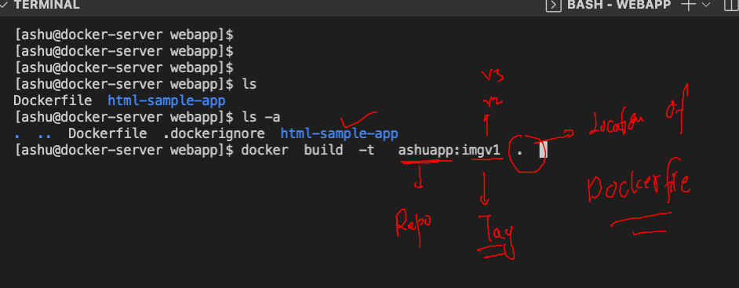
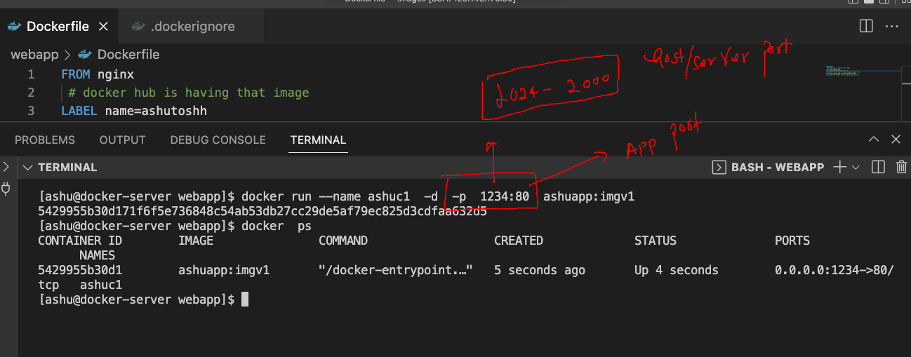
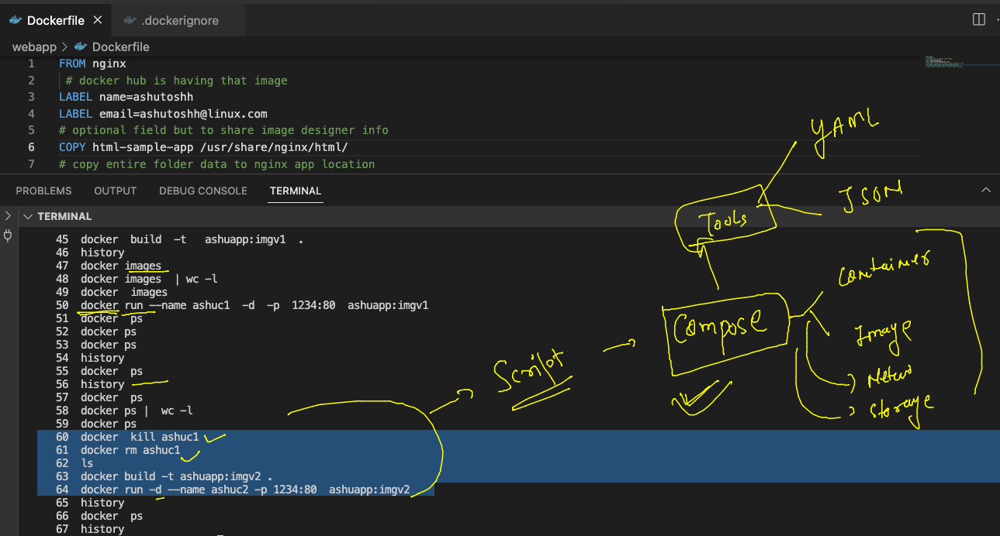

## Training plan 


### VM vs containers 


### OS kernel support


### Docker architecture 


### oracle support for CRE 


### Installing docker in OL 7.9 

### checking things 

```
[root@docker-server ~]# rpm -q docker 
package docker is not installed
[root@docker-server ~]# rpm -qa  |   grep  -i  docker 
[root@docker-server ~]# 
[root@docker-server ~]# cat /etc/os-release 
NAME="Oracle Linux Server"
VERSION="7.9"
ID="ol"
ID_LIKE="fedora"
VARIANT="Server"
VARIANT_ID="server"
VERSION_ID="7.9"
PRETTY_NAME="Oracle Linux Server 7.9"
ANSI_COLOR="0;31"
CPE_NAME="cpe:/o:oracle:linux:7:9:server"
HOME_URL="https://linux.oracle.com/"
BUG_REPORT_URL="https://bugzilla.oracle.com/"
```

### install docker 

```
 yum install docker-engine docker-cli  
Failed to set locale, defaulting to C
Loaded plugins: langpacks, ulninfo
ol7_MySQL80                                                                                              | 3.0 kB  00:00:00     
ol7_MySQL80_connectors_community                                                                         | 2.9 kB  00:00:00     
ol7_MySQL80_tools_community                                                                              | 2.9 kB  00:00:00     
ol7_UEKR6                                                                                                | 3.0 kB  00:00:00     
ol7_addons                                                                                               | 3.0 kB  00:00:00     
ol7_ksplice                       
```

### starting docker service 

```
[root@docker-server ~]# systemctl status docker 
● docker.service - Docker Application Container Engine
   Loaded: loaded (/usr/lib/systemd/system/docker.service; disabled; vendor preset: disabled)
   Active: inactive (dead)
     Docs: https://docs.docker.com
[root@docker-server ~]# systemctl start   docker 
[root@docker-server ~]# systemctl status docker 
● docker.service - Docker Application Container Engine
   Loaded: loaded (/usr/lib/systemd/system/docker.service; disabled; vendor preset: disabled)
   Active: active (running) since Mon 2022-07-04 05:06:46 GMT; 1s ago
     Docs: https://docs.docker.com
 Main PID: 11682 (dockerd)
    Tasks: 10
   Memory: 32.3M
   CGroup: /system.slice/docker.service
           └─11682 /usr/bin/dockerd -H fd:// --containerd=/run/containerd/containerd.sock

Jul 04 05:06:46 docker-server dockerd[11682]: time="2022-07-04T05:06:46.168575369Z" level=warning msg="Your kernel does...eight"
Jul 04 05:06:46 docker-server dockerd[11682]: time="2022-07-04T05:06:46.168602971Z" level=warning msg="Your kernel does...evice"
Jul 04 05:06:46 docker-server dockerd[11682]: time="2022-07-04T05:06:46.168939850Z" level=info msg="Loading containers: start."
Jul 04 05:06:46 docker-server dockerd[11682]: time="2022-07-04T05:06:46.382854273Z" level=info msg="Default bridge (doc...dress"
Jul 04 05:06:46 docker-server dockerd[11682]: time="2022-07-04T05:06:46.501425558Z" level=info msg="Loading containers: done."
Jul 04 05:06:46 docker-server dockerd[11682]: time="2022-07-04T05:06:46.510313197Z" level=warning msg="Not using native...erlay2
Jul 04 05:06:46 docker-server dockerd[11682]: time="2022-07-04T05:06:46.510469282Z" level=info msg="Docker daemon" comm....11-ol
Jul 04 05:06:46 docker-server dockerd[11682]: time="2022-07-04T05:06:46.510581696Z" level=info msg="Daemon has complete...ation"
Jul 04 05:06:46 docker-server dockerd[11682]: time="2022-07-04T05:06:46.538289934Z" level=info msg="API listen on /var/....sock"
Jul 04 05:06:46 docker-server systemd[1]: Started Docker Application Container Engine.
Hint: Some lines were ellipsized, use -l to show in full.
[root@docker-server ~]# systemctl enable  docker 
Created symlink from /etc/systemd/system/multi-user.target.wants/docker.service to /usr/lib/systemd/system/docker.service.
[root@docker-server ~]# 

```

### giving access to non root users 

### creating multiple users 

```
for  i in  ashu  arvind asad gaurav jijin krishna  manjunath natarajan reddy narayan pradeep ramesh rohit   shankar vinod 
do useradd $i
echo "Docker@123456"  |  passwd $i --stdin 
done 
```

### giving access 

```
[root@docker-server ~]# for  i  in  `ls /home`
> do
> usermod -aG docker $i
> done
[root@docker-server ~]# 
```

### single user 

```
usermod -aG docker <username>
```

### in Vscode terminal 

```
[ashu@docker-server ~]$ whoami
ashu
[ashu@docker-server ~]$ docker  version 
Client: Docker Engine - Community
 Version:           19.03.11-ol
 API version:       1.40
 Go version:        go1.16.2
 Git commit:        9bb540d
 Built:             Fri Jul 23 01:33:55 2021
 OS/Arch:           linux/amd64
 Experimental:      false

Server: Docker Engine - Community
 Engine:
  Version:          19.03.11-ol
  API version:      1.40 (minimum version 1.12)
  Go version:       go1.16.2
  Git commit:       9bb540d
  Built:            Fri Jul 23 01:32:08 2021
```

### docker image to docker containers 



### creating images using dockerfile 

```
[ashu@docker-server ~]$ mkdir  images
[ashu@docker-server ~]$ ls
images
[ashu@docker-server ~]$ mkdir  images/webapp  
[ashu@docker-server ~]$ mkdir  images/javacode 
[ashu@docker-server ~]$ mkdir  images/pythoncode
[ashu@docker-server ~]$ ls  images/
javacode  pythoncode  webapp
```

### sample html based project for container 

```
git clone  https://github.com/schoolofdevops/html-sample-app
Cloning into 'html-sample-app'...
remote: Enumerating objects: 74, done.
remote: Total 74 (delta 0), reused 0 (delta 0), pack-reused 74
Unpacking objects: 100% (74/74), done.
```

### content of dockerfile 

```
[ashu@docker-server webapp]$ ls
html-sample-app
[ashu@docker-server webapp]$ 
[ashu@docker-server webapp]$ touch Dockerfile
[ashu@docker-server webapp]$ ls
Dockerfile  html-sample-app
```
### web app server Nginx 



### Dockerfile 

```
FROM nginx
 # docker hub is having that image 
LABEL name=ashutoshh 
LABEL email=ashutoshh@linux.com 
# optional field but to share image designer info 
COPY html-sample-app /usr/share/nginx/html/
# copy entire folder data to nginx app location 
```

### .dockerignore 

```
html-sample-app/.git
html-sample-app/LICENSE.txt
html-sample-app/README.txt
```

### final directory structure 

```
[ashu@docker-server webapp]$ ls  -a
.  ..  Dockerfile  .dockerignore  html-sample-app
```

### now building app to image 




```
[ashu@docker-server webapp]$ ls -a
.  ..  Dockerfile  .dockerignore  html-sample-app
[ashu@docker-server webapp]$ docker  build  -t   ashuapp:imgv1  .  
Sending build context to Docker daemon  2.099MB
Step 1/4 : FROM nginx
Trying to pull repository docker.io/library/nginx ... 
latest: Pulling from docker.io/library/nginx
b85a868b505f: Pull complete 
f4407ba1f103: Pull complete 
4a7307612456: Pull complete 
935cecace2a0: Pull complete 
8f46223e4234: Pull complete 
fe0ef4c895f5: Pull complete 
Digest: sha256:10f14ffa93f8dedf1057897b745e5ac72ac5655c299dade0aa434c71557697ea
Status: Downloaded newer image for nginx:latest
 ---> 55f4b40fe486
Step 2/4 : LABEL name=ashutoshh
 ---> Running in 8f8e1e476af4
Removing intermediate container 8f8e1e476af4
 ---> 226d7e896ad5
Step 3/4 : LABEL email=ashutoshh@linux.com
 ---> Running in 8289654b0f66
Removing intermediate container 8289654b0f66
 ---> 6f8a559d403a
Step 4/4 : COPY html-sample-app /usr/share/nginx/html/
 ---> 4b580df91925
Successfully built 4b580df91925
Successfully tagged ashuapp:imgv1
```

### docker run 




### list of running containers 

```
[ashu@docker-server webapp]$ docker  ps
CONTAINER ID        IMAGE               COMMAND                  CREATED              STATUS              PORTS                          NAMES
f1b2702dbbd0        mari:imagev1        "/docker-entrypoint.…"   3 seconds ago        Up 2 seconds        0.0.0.0:1244->80/tcp           mariappanwebapp
2d9d96f42725        gauravapp:imgv1     "/docker-entrypoint.…"   4 seconds ago        Up 4 seconds        0.0.0.0:1280->80/tcp           gaur2
c84f37f00402        aravindapp:imgv1    "/docker-entrypoint.…"   14 seconds ago       Up 13 seconds       0.0.0.0:1235->80/tcp           aravind2
c52be1e53a86        krisapp:imgv1       "/docker-entrypoint.…"   27 seconds ago       Up 27 seconds       0.0.0.0:1536->80/tcp           kris1
2bb6a67bd1ea        narayanapp:1        "/docker-entrypoint.…"   43 seconds ago       Up 42 seconds       0.0.0.0:1333->80/tcp           nara1
288fa74510ea        reddyrep:imgv1      "/docker-entrypoint.…"   About a minute ago   Up About a minute   0.0.0.0:1055->80/tcp           reddycont
cdb962ef02ed        vinodapp:imgv2 
```

### if we change app or dockerfile then --

```
60  docker  kill ashuc1
   61  docker rm ashuc1
   62  ls
   63  docker build -t ashuapp:imgv2 . 
   64  docker run -d --name ashuc2 -p 1234:80  ashuapp:imgv2 
```


### docker compose for docker cli scripting 



### lets clean up 

```
[ashu@docker-server webapp]$ docker kill ashuc2
ashuc2
[ashu@docker-server webapp]$ docker  rm  ashuc2 
ashuc2
[ashu@docker-server webapp]$ 


[ashu@docker-server webapp]$ docker  rmi  ashuapp:imgv1 
Untagged: ashuapp:imgv1
[ashu@docker-server webapp]$ docker  rmi  ashuapp:imgv2
Untagged: ashuapp:imgv2
Deleted: sha256:6ebfd93106b2e9eaefa1ce02c00e11441e90ca86813c90c940949cb12f4b5291
Deleted: sha256:72cab716382d21f596360e0d5e27e2645693f3e79e7069a57778b0f841e3c992
[ashu@docker-server webapp]$ 

```

### compsoe client side tool 

### installation 

```
curl -SL https://github.com/docker/compose/releases/download/v2.6.1/docker-compose-linux-x86_64 -o /usr/bin/docker-compose 
  % Total    % Received % Xferd  Average Speed   Time    Time     Time  Current
                                 Dload  Upload   Total   Spent    Left  Speed
  0     0    0     0    0     0      0      0 --:--:-- --:--:-- --:--:--     0
100 24.5M  100 24.5M    0     0  18.3M      0  0:00:01  0:00:01 --:--:-- 43.2M
[root@docker-server ~]# 
[root@docker-server ~]# chmod +x /usr/bin/docker-compose 
[root@docker-server ~]# docker-compose -v
Docker Compose version v2.6.1
[root@docker-server ~]# 

```

### to use compsoe lets understanding docker components 

### networking 


### checking networking 

```
[ashu@docker-server webapp]$ docker  network ls
NETWORK ID          NAME                DRIVER              SCOPE
eb903769f600        bridge              bridge              local
19d30894d86c        host                host                local
47aaf11e6e6c        none                null                local
[ashu@docker-server webapp]$ docker  network inspect bridge 
[
    {
        "Name": "bridge",
        "Id": "eb903769f600c6e2b9e5333bea47b85a137f6994c183713624ea76d697e9d514",
        "Created": "2022-07-04T05:06:46.383066967Z",
        "Scope": "local",
        "Driver": "bridge",
        "EnableIPv6": false,
        "IPAM": {
            "Driver": "default",
            "Options": null,
            "Config": [
                {
                    "Subnet": "172.17.0.0/16"
                }
```

### compose file example 1 

```
version: '3.8' # file version 
services:
  ashuapp1: # name of app used by compose 
    image: ashuapp:imgv3 # name of image to be build
    build: . # location of dockerfile 
    container_name: ashuc3 
    ports:
    - "1234:80"
```

### lets run it 

```
[ashu@docker-server ashuwebapp]$ ls
docker-compose.yaml  Dockerfile  html-sample-app
[ashu@docker-server ashuwebapp]$ docker-compose up -d 
[+] Running 0/1
 ⠧ ashuapp1 Pulling                                                                                                  0.7s
[+] Building 1.0s (7/7) FINISHED                                                                                          
 => [internal] load build definition from Dockerfile                                                                 0.0s
 => => transferring dockerfile: 343B                                                                                 0.0s
 => [internal] load .dockerignore                                                                                    0.0s
 => => transferring context: 174B                                                                                    0.0s
 => [internal] load metadata for docker.io/library/nginx:latest                                                      0.0s
 => [internal] load build context                                                                                    0.0s
 => => transferring context: 2.05MB                                                                                  0.0s
 => [1/2] FROM docker.io/library/nginx                                                                               0.0s
 => => resolve docker.io/library/nginx:latest                                                                        0.0s
 => [2/2] COPY html-sample-app /usr/share/nginx/html/                                                                0.0s
 => exporting to image                                                                                               0.8s
 => => exporting layers                                                                                              0.8s
 => => writing image sha256:8addb4e190a241e9b3c26807860248dc4989c0d91b7ab364e5715b6aa8ba1b06                         0.0s
 => => naming to docker.io/library/ashuapp:imgv3                                                                     0.0s
[+] Running 2/2
 ⠿ Network ashuwebapp_default  Created                                                                               0.1s
 ⠿ Container ashuc3            Started    
```

### more commands 

```
[ashu@docker-server ashuwebapp]$ docker-compose  ps
NAME                COMMAND                  SERVICE             STATUS              PORTS
ashuc3              "/docker-entrypoint.…"   ashuapp1            running             0.0.0.0:1234->80/tcp
[ashu@docker-server ashuwebapp]$ docker-compose  images
Container           Repository          Tag                 Image Id            Size
ashuc3              ashuapp             imgv3               8addb4e190a2        144MB
```

### cleanup 

```
[ashu@docker-server ashuwebapp]$ docker-compose down 
[+] Running 2/2
 ⠿ Container ashuc3            Removed                                                                               0.5s
 ⠿ Network ashuwebapp_default  Removed   
```

### Example 2 for compsoe :-

```
version: '3.8' # file version 
services:
  ashuapp2: 
    image: alpine
    container_name: ashuc2
    command: ping www.google.com 
  ashuapp1: # name of app used by compose 
    image: ashuapp:imgv3 # name of image to be build
    build: . # location of dockerfile 
    container_name: ashuc3 
    ports:
    - "1234:80"
```

###

```
[ashu@docker-server ashuwebapp]$ docker-compose up -d  --build  
[+] Building 0.0s (7/7) FINISHED                                                                                          
 => [internal] load build definition from Dockerfile                                                                 0.0s
 => => transferring dockerfile: 91B                                                                                  0.0s
 => [internal] load .dockerignore                                                                                    0.0s
 => => transferring context: 93B                                                                                     0.0s
 => [internal] load metadata for docker.io/library/nginx:latest                                                      0.0s
 => [internal] load build context                                                                                    0.0s
 => => transferring context: 8.33kB                                                                                  0.0s
 => [1/2] FROM docker.io/library/nginx                                                                               0.0s
 => CACHED [2/2] COPY html-sample-app /usr/share/nginx/html/                                                         0.0s
 => exporting to image                                                                                               0.0s
 => => exporting layers                                                                                              0.0s
 => => writing image sha256:8addb4e190a241e9b3c26807860248dc4989c0d91b7ab364e5715b6aa8ba1b06                         0.0s
 => => naming to docker.io/library/ashuapp:imgv3                                                                     0.0s
[+] Running 2/2
 ⠿ Container ashuc3  Started                                                                                         0.5s
 ⠿ Container ashuc2  Running      
```

### clean up again 

```
[ashu@docker-server ashuwebapp]$ docker-compose down 
[+] Running 3/3
 ⠿ Container ashuc3            Removed                                                                               0.5s
 ⠿ Container ashuc2            Removed                                                                              10.4s
 ⠿ Network ashuwebapp_default  Removed                                                                               0.1s
[ashu@docker-server ashuwebapp]$ 
```

### Example 3 : 

```
version: '3.8' # file version 
services:
  ashuapp2: 
    image: alpine # image from docker hub 
    container_name: ashuc2
    command: ping www.google.com 
  ashuapp1: # name of app used by compose 
    image: ashuapp:imgv3 # name of image to be build
    build:  # total build details 
      context: . # location of dockerfile 
      dockerfile: project.dockerfile # name of dockerfile
    container_name: ashuc3 
    ports:
    - "1239:80"

```

### creating network bridge manually 

```
[root@docker-server ~]# docker  network  create   ashubr1  
4e85d8253ed106c471f6a6e8b3452d2f603d79e05f44a93501300a8be62592a3
[root@docker-server ~]# docker  network ls
NETWORK ID          NAME                  DRIVER              SCOPE
4e85d8253ed1        ashubr1               bridge              local
eb903769f600        bridge                bridge              local
19d30894d86c        host                  host                local
c491aa5ac4b7        mariwebapp_default    bridge              local
47aaf11e6e6c        none                  null                local
d9c8d6b05d0d        ramswebapp_default    bridge              local
4406901381ee        reddywebapp_default   bridge              local
[root@docker-server ~]# docker  network inspect ashubr1 
[
    {
        "Name": "ashubr1",
        "Id": "4e85d8253ed106c471f6a6e8b3452d2f603d79e05f44a93501300a8be62592a3",
        "Created": "2022-07-04T08:57:56.831056524Z",
        "Scope": "local",
        "Driver": "bridge",
        "EnableIPv6": false,
        "IPAM": {
            "Driver": "default",
            "Options": {},
            "Config": [
                {
                    "Subnet": "172.29.0.0/16",
                    "Gateway": "172.29.0.1"
                }
            ]

```

### docker network with custom subnets 

```
[root@docker-server ~]# 
[root@docker-server ~]# docker  network  create ashubr2  --subnet  192.168.100.0/24 
9e114871f45386c0605a33de2228ef46bda7e61e1fe8c997d2109e0a9ebf0e60
[root@docker-server ~]# docker network ls
NETWORK ID          NAME                 DRIVER              SCOPE
4e85d8253ed1        ashubr1              bridge              local
9e114871f453        ashubr2              bridge              local
eb903769f600        bridge               bridge              local

```

### testing container networking 

```
[root@docker-server ~]# docker  run -itd --name c1  --network ashubr1  alpine  
556cab1db6b4e6640265791499716bd2a92881a8b90259b1e85c08e11c5861d2
[root@docker-server ~]# docker  run -itd --name c2  --network ashubr1  alpine  
347e32e3a9e2d73cb185b203b483676fdb507d1969c52d95283f812fcd61e11c
[root@docker-server ~]# 
[root@docker-server ~]# 
[root@docker-server ~]# docker  run -itd --name c3  --network ashubr2  alpine  
3f58b3c6a081246fb59e0cbd9fbfaff2cb5a3e86217b3bd9514c5d94b5edd3ab
[root@docker-server ~]# 
[root@docker-server ~]# docker  run -itd --name c4  --network ashubr2  alpine  
502fc8c4521143d6ea0a050bd8461fde1fdb8619f0e2f9ba765930818257569d
[root@docker-server ~]# 
[root@docker-server ~]# docker  exec  -it c1  sh 
/ # ping c2
PING c2 (172.29.0.3): 56 data bytes
64 bytes from 172.29.0.3: seq=0 ttl=64 time=0.092 ms
^C
--- c2 ping statistics ---
1 packets transmitted, 1 packets received, 0% packet loss
round-trip min/avg/max = 0.092/0.092/0.092 ms
/ # ping c3
ping: bad address 'c3'
/ # exit
[root@docker-server ~]# docker  exec  -it c3  sh 
/ # ping c1
ping: bad address 'c1'
/ # ping c4
PING c4 (192.168.100.3): 56 data bytes
64 bytes from 192.168.100.3: seq=0 ttl=64 time=0.090 ms
64 bytes from 192.168.100.3: seq=1 ttl=64 time=0.056 ms
^C
--- c4 ping statistics ---
2 packets transmitted, 2 packets received, 0% packet loss
round-trip min/avg/max = 0.056/0.073/0.090 ms
/ # 

```


