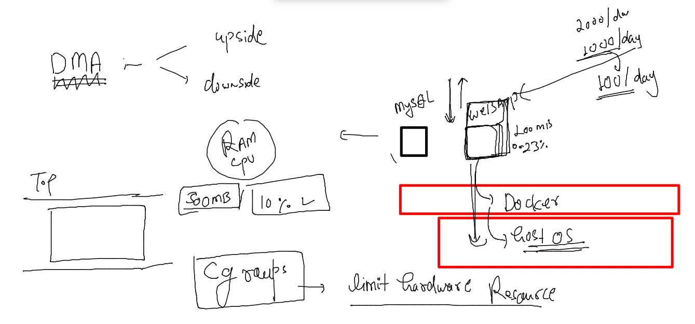
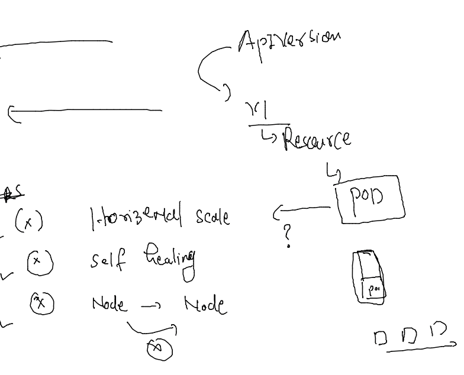

## Training plan 


### Info about POdman 

### OL8 based installation 

```
[root@podman ~]# dnf  install podman 
Ksplice for Oracle Linux 8 (x86_64)                                                           11 MB/s | 992 kB     00:00    
MySQL 8.0 for Oracle Linux 8 (x86_64)                                                         23 MB/s | 2.4 MB     00:00    
MySQL 8.0 Tools Community for Oracle Linux 8 (x86_64)                                        6.5 MB/s | 308 kB     00:00    
MySQL 8.0 Connectors Community for Oracle Linux 8 (x86_64)                                   521 kB/s |  23 kB     00:00    
Oracle Software for OCI users on Oracle Linux 8 (x86_64)                                      72 MB/s |  40 MB     00:00    
Oracle Linux 8 BaseOS Latest (x86_64)                                                         69 MB/s |  47 MB     00:00    
Oracle Linux 8 Application Stream (x86_64)                                                    72 MB/s |  37 MB     00:00    
Oracle Linux 8 Addons (x86_64)                                                                40 MB/s | 4.1 MB     00:00    
Latest Unbreakable Enterprise Kernel Release 6 for Oracle Linux 8 (x86_64)                    72 MB/s |  50 MB     00:00    
Dependencies resolved.
=============================================================================================================================
 Package                          Arch        Version                                           Repository              Size
=============================================================================================================================
Installing:
 podman                           x86_64      2:4.0.2-6.module+el8.6.0+20665+a3b29bef           ol8_appstream           13 M
Installing dependencies:
 conmon                           x86_64      2:2.1.0-1.module+el8.6.0+20665+a3b29bef           ol8_appstream           55 k
 container-selinux                noarch      2:2.179.1-1.module+el8.6.0+20665+a3b29bef         ol8_appstream           58 k
 containernetworking-plugins      x86_64      1:1.0.1-2.module+el8.6.0+20665+a3b29bef           ol8_appstream           18 M
 containers-common                x86_64      2:1-27.0.1.module+el8.6.0+20665+a3b29bef          ol8_appstream           67 k
 criu                             x86_64      3.15-3.module+el8.6.0+20665+a3b29bef              ol8_appstream          518 k
 fuse-common                      x86_6
```

### conf of podman 

```
[root@podman ~]# cd /etc/containers/
[root@podman containers]# ls
certs.d  oci  policy.json  registries.conf  registries.conf.d  registries.d  storage.conf
```

### podman --

```
[root@podman containers]# podman ps 
CONTAINER ID  IMAGE                            COMMAND      CREATED        STATUS            PORTS       NAMES
1a3a6337f224  docker.io/library/alpine:latest  ping fb.com  6 seconds ago  Up 6 seconds ago              x1
[root@podman containers]# podman network ls
NETWORK ID    NAME        DRIVER
2f259bab93aa  podman      bridge
[root@podman containers]# podman network inspect podman 
[
     {
          "name": "podman",
          "id": "2f259bab93aaaaa2542ba43ef33eb990d0999ee1b9924b557b7be53c0b7a1bb9",
          "driver": "bridge",
          "network_interface": "cni-podman0",
          "created": "2022-07-05T04:25:12.176604162Z",
          "subnets": [
               {
                    "subnet": "10.88.0.0/16",
                    "gateway": "10.88.0.1"
```

###  More container logics 

### Cgroups -- 



### Demo 1 

```
 docker  run -d --name ashudb1 -e MYSQL_ROOT_PASSWORD="Docker@123456"  mysql 
Unable to find image 'mysql:latest' locally
Trying to pull repository docker.io/library/mysql ... 
latest: Pulling from docker.io/library/mysql
824b15f81d65: Pull complete 
c559dd1913db: Pull complete 
e201c19614e6: Pull complete 
f4247e8f6125: Pull complete 
dc9fefd8cfb5: Pull complete 
af3787edd16d: Pull complete 
b6bb40f875d3: Pull complete 
75f6b647ddb1: Pull complete 
a09ca0f0cb24: Pull complete 
9e223e3cd2fd: Pull complete 
2b038d826c65: Pull complete 
d33ac6052fc9: Pull complete 
Digest: sha256:a840244706a5fdc3c704b15a3700bfda39fdc069262d7753fa09de2d9faf5f83
Status: Downloaded newer image for mysql:latest
d4dce6149ed6a961705c793a37d5b92fdc49fbaf1c6ec526624dd39729e90671
[ashu@docker-server images]$ docker  ps
CONTAINER ID        IMAGE               COMMAND                  CREATED             STATUS              PORTS                 NAMES
28b67125f7b2        mysql               "docker-entrypoint.s…"   14 seconds ago      Up 13 seconds       3306/tcp, 33060/tcp   prddb1
d4dce6149ed6        mysql               "docker-entrypoint.s…"   38 seconds ago      Up 29 seconds       3306/tcp, 33060/tcp   ashudb1
[ashu@docker-server images]$ 
```

### check ip of container 

```
[ashu@docker-server images]$ docker  inspect  ashudb1  --format='{{.NetworkSettings.IPAddress}}'
172.17.0.2
```

### checking logs 

```
[ashu@docker-server images]$ docker logs   ashudb1
2022-07-05 04:39:25+00:00 [Note] [Entrypoint]: Entrypoint script for MySQL Server 8.0.29-1debian10 started.
2022-07-05 04:39:25+00:00 [Note] [Entrypoint]: Switching to dedicated user 'mysql'
2022-07-05 04:39:25+00:00 [Note] [Entrypoint]: Entrypoint script for MySQL Server 8.0.29-1debian10 started.
2022-07-05 04:39:25+00:00 [Note] [Entrypoint]: Initializing database files
2022-07-05T04:39:25.236592Z 0 [System] [MY-013169] [Server] /usr/sbin/mysqld (mysqld 8.0.29) initializing of server in progress as process 41
2022-07-05T04:39:25.242037Z 1 [System] [MY-013576] [InnoDB] InnoDB initialization has started.
2022-07-05T04:39:26.495836Z 1 [System] [MY-013577] [InnoDB] InnoDB initialization has ended.
2022-07-05T04:39:27.394833Z 6 [Warning] [MY-010453] [Server] root@localhost is created with an empty password ! Please consider switching off the --initialize-insecure option.
```

### connecting to Db 

```
[root@docker-server ~]# docker  exec -it ashudb1  bash 
root@d4dce6149ed6:/# mysql -u root -p
Enter password: 
Welcome to the MySQL monitor.  Commands end with ; or \g.
Your MySQL connection id is 8
Server version: 8.0.29 MySQL Community Server - GPL

Copyright (c) 2000, 2022, Oracle and/or its affiliates.

Oracle is a registered trademark of Oracle Corporation and/or its
affiliates. Other names may be trademarks of their respective
owners.

Type 'help;' or '\h' for help. Type '\c' to clear the current input statement.

mysql> show databases; 
+--------------------+
| Database           |
+--------------------+
| information_schema |
| mysql              |
| performance_schema |
| sys                |
+--------------------+
4 rows in set (0.01 sec)

```

### limit containers 

```
[ashu@docker-server images]$ docker  run -d --name ashudb2 -e MYSQL_ROOT_PASSWORD="Docker@123456" --memory 400M --cpu-shares=30  mysql 
b87113ef09ac7eda00a08c4883492c8dbffc42e0c60855efdc75b446e2c678df
[ashu@docker-server images]$ 
```

### more cpu options 

```
[ashu@docker-server images]$ docker run --help |  grep -i cpu 
      --cpu-period int                 Limit CPU CFS (Completely Fair Scheduler) period
      --cpu-quota int                  Limit CPU CFS (Completely Fair Scheduler) quota
      --cpu-rt-period int              Limit CPU real-time period in microseconds
      --cpu-rt-runtime int             Limit CPU real-time runtime in microseconds
  -c, --cpu-shares int                 CPU shares (relative weight)
      --cpus decimal                   Number of CPUs
      --cpuset-cpus string             CPUs in which to allow execution (0-3, 0,1)
      --cpuset-mems string             MEMs in which to allow execution (0-3, 0,1)
```

### multi stage dockerfile 


### directory structure --

```
ashu@docker-server javacode]$ ls
java-springboot
[ashu@docker-server javacode]$ touch multi-stage.dockerfile
[ashu@docker-server javacode]$ ls
java-springboot  multi-stage.dockerfile
[ashu@docker-server javacode]$ ls -a
.  ..  .dockerignore  java-springboot  multi-stage.dockerfile
[ashu@docker-server javacode]$ 

```

### MUltistage Dockerfile 

```
from oraclelinux:8.4  as Stage1 
label name=ashutoshh
label email=ashutoshh@linux.com
RUN mkdir /javawebapp 
# RUN is to get shell while building image 
ADD java-springboot  /javawebapp/ 
# ADD is similar to COPY both can copy folder data 
RUN yum install java-1.8.0-openjdk.x86_64 java-1.8.0-openjdk-devel.x86_64 maven -y 
WORKDIR /javawebapp
# changing directory during build time 
# workdir is like cd command in linux/unix 
RUN mvn clean package 
# build java source code into .war file -- target/WebApp.war 
FROM tomcat 
LABEL email=ashutoshh@linux.com
COPY --from=Stage1  /javawebapp/target/WebApp.war /usr/local/tomcat/webapps/ 
```

### .dockerignore 

```
java-springboot/.git
java-springboot/README.md
```

### lets build it 

```
[ashu@docker-server javacode]$ ls -a
.  ..  .dockerignore  java-springboot  multi-stage.dockerfile
[ashu@docker-server javacode]$ docker  build  -t  ashuspring:appv1  -f multi-stage.dockerfile  . 
Sending build context to Docker daemon  15.36kB
Step 1/11 : from oraclelinux:8.4  as Stage1
 ---> 97e22ab49eea
Step 2/11 : label name=ashutoshh
 ---> Running in 064f465b12c0
Removing intermediate container 064f465b12c0
 ---> 7c791f5f2606
Step 3/11 : label email=ashutoshh@linux.com
 ---> Running in 9ff10b4a1c69
Removing intermediate container 9ff10b4a1c69
 ---> 02738e9d5286
Step 4/11 : RUN mkdir /javawebapp
 ---> Running in f34bf1b0c9d8
Removing intermediate container f34bf1b0c9d8
 ---> 1c14d8cf65c4
Step 5/11 : ADD java-springboot  /javawebapp/
 ---> 9731bd0e1d4a
```

### container to kubernetes 


### container at prod level need more attention 



### tools for container orchestration 


### info about k8s 


### getting started with k8s architecture 


### setup client side kubectl installation 

```
[root@k8s-client ~]# curl -LO "https://dl.k8s.io/release/$(curl -L -s https://dl.k8s.io/release/stable.txt)/bin/linux/amd64/kubectl"
  % Total    % Received % Xferd  Average Speed   Time    Time     Time  Current
                                 Dload  Upload   Total   Spent    Left  Speed
100   154  100   154    0     0    873      0 --:--:-- --:--:-- --:--:--   875
100 43.5M  100 43.5M    0     0  67.7M      0 --:--:-- --:--:-- --:--:--  148M
[root@k8s-client ~]# ls
kubectl
[root@k8s-client ~]# mv kubectl /usr/bin/
[root@k8s-client ~]# chmod +x /usr/bin/kubectl 
[root@k8s-client ~]# 
[root@k8s-client ~]# kubectl version --client 
WARNING: This version information is deprecated and will be replaced with the output from kubectl version --short.  Use --output=yaml|json to get the full version.
Client Version: version.Info{Major:"1", Minor:"24", GitVersion:"v1.24.2", GitCommit:"f66044f4361b9f1f96f0053dd46cb7dce5e990a8", GitTreeState:"clean", BuildDate:"2022-06-15T14:22:29Z", GoVersion:"go1.18.3", Compiler:"gc", Platform:"linux/amd64"}
Kustomize Version: v4.5.4
[root@k8s-client ~]# 
[root@k8s-client ~]# 
[root@k8s-client ~]# kubectl version --client  -o yaml 
clientVersion:
  buildDate: "2022-06-15T14:22:29Z"
  compiler: gc
  gitCommit: f66044f4361b9f1f96f0053dd46cb7dce5e990a8
  gitTreeState: clean
  gitVersion: v1.24.2
  goVersion: go1.18.3
  major: "1"
  minor: "24"
  platform: linux/amd64
kustomizeVersion: v4.5.4

```

### k8s components 

### master Side / control plane 

### api-server 


### kube-schedular 


### ETCD 


### k8s Nodes 


### SETup methods -- 


### getting auth file for k8s client/dev


### connecting from client

```
[ashu@k8s-client images]$ kubectl  version  -o yaml   --kubeconfig  admin.conf 
clientVersion:
  buildDate: "2022-06-15T14:22:29Z"
  compiler: gc
  gitCommit: f66044f4361b9f1f96f0053dd46cb7dce5e990a8
  gitTreeState: clean
  gitVersion: v1.24.2
  goVersion: go1.18.3
  major: "1"
  minor: "24"
  platform: linux/amd64
kustomizeVersion: v4.5.4
serverVersion:
  buildDate: "2022-06-15T14:15:38Z"
  compiler: gc
  gitCommit: f66044f4361b9f1f96f0053dd46cb7dce5e990a8
  gitTreeState: clean
  gitVersion: v1.24.2
  goVersion: go1.18.3
  major: "1"
  minor: "24"
  platform: linux/amd64
```

####

```
[ashu@k8s-client images]$ kubectl  cluster-info  --kubeconfig admin.conf 
Kubernetes control plane is running at https://44.207.251.87:6443
CoreDNS is running at https://44.207.251.87:6443/api/v1/namespaces/kube-system/services/kube-dns:dns/proxy

To further debug and diagnose cluster problems, use 'kubectl cluster-info dump'.
```

### done 

```
[ashu@k8s-client images]$ cp -v admin.conf  ~/.kube/config 
‘admin.conf’ -> ‘/home/ashu/.kube/config’
[ashu@k8s-client images]$ 
[ashu@k8s-client images]$ 
[ashu@k8s-client images]$ kubectl  cluster-info 
Kubernetes control plane is running at https://44.207.251.87:6443
CoreDNS is running at https://44.207.251.87:6443/api/v1/namespaces/kube-system/services/kube-dns:dns/proxy

To further debug and diagnose cluster problems, use 'kubectl cluster-info dump'.
[ashu@k8s-client images]$ kubectl  get nodes
NAME            STATUS   ROLES           AGE     VERSION
control-plane   Ready    control-plane   4h13m   v1.24.2
node1           Ready    <none>          4h12m   v1.24.2
node2           Ready    <none>          4h12m   v1.24.2
```

### k8s deals with POd 


### pod design 

### demo 

```
apiVersion: v1 # apiserver version 
kind: Pod # resource under apiversion v1  
metadata: # info about resource 
  name: ashupod-123 # name of pod
spec: # info about app-->container/networking/storage/security
  containers:
  - name: ashuc1
    image: dockerashu/ashutoshhapp:v1
    ports:
    - containerPort: 80 
```

### deploy pod and checking it 

```
[ashu@k8s-client k8s_app_deploy]$ ls
ashupod1.yaml
[ashu@k8s-client k8s_app_deploy]$ kubectl apply -f  ashupod1.yaml 
pod/ashupod-123 created
[ashu@k8s-client k8s_app_deploy]$ kubectl  get  pods 
NAME           READY   STATUS             RESTARTS   AGE
ashupod-123    1/1     Running            0          13s
```


