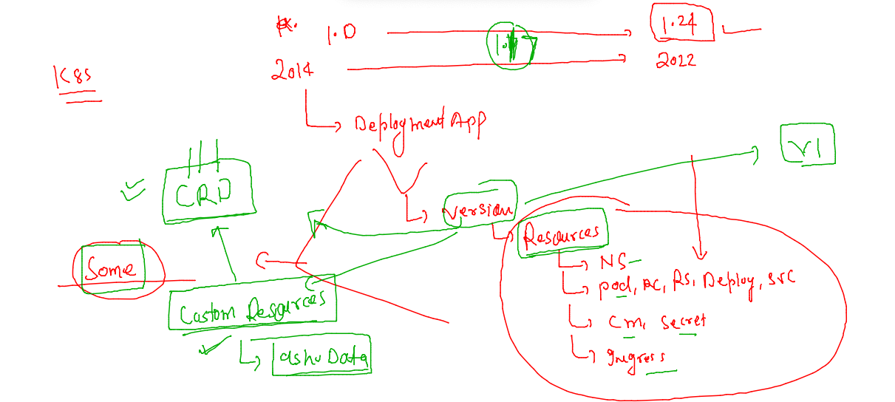

## Training plan 


### clean namespace data 

```
[ashu@docker-server images]$ kubectl  delete all --all
pod "ashuwebapp-7d9ff7df76-2fcp9" deleted
pod "ashuwebapp-7d9ff7df76-nfxpl" deleted
pod "ashuwebapp-7d9ff7df76-qr676" deleted
service "ashu-local-lb" deleted
deployment.apps "ashuwebapp" deleted
horizontalpodautoscaler.autoscaling "ashuwebapp" deleted

```

###

```
[ashu@docker-server images]$ kubectl  delete  cm,secret  --all
configmap "ashucm" deleted
configmap "kube-root-ca.crt" deleted
secret "ashu-sec" deleted
secret "ashuapp-sec" deleted
```

## deploy database --

### creating configmap 

```
apiVersion: v1
kind: ConfigMap
metadata:
  creationTimestamp: null
  name: ashudb-cm
data:
  MYSQL_USER: oracle
  MYSQL_DATABASE: mydb 

```

### creating secret to store info 

```
kubectl  create  secret  generic  db-cred  --from-literal  rootpw="Cisco@12345" --from-literal  upass="Docker@123456"  --dry-run=client -o yaml  >dbsecret.yaml


```

### deployment file 

```
apiVersion: apps/v1
kind: Deployment
metadata:
  creationTimestamp: null
  labels:
    app: ashudb
  name: ashudb # name of deployment 
spec:
  replicas: 1
  selector:
    matchLabels:
      app: ashudb
  strategy: {}
  template: # template section 
    metadata:
      creationTimestamp: null
      labels:
        app: ashudb
    spec:
      containers:
      - image: mysql
        name: mysql
        ports:
        - containerPort: 3306
        envFrom: # calling env and value directly 
        - configMapRef:
            name: ashudb-cm 
        env: # to call 
        - name: MYSQL_ROOT_PASSWORD
          valueFrom:
            secretKeyRef:
              name: db-cred
              key: rootpw
        - name: MYSQL_PASSWORD 
          valueFrom:
            secretKeyRef:
              name: db-cred
              key: upass 
        resources: {}
status: {}

```

### lets deploy it 

```
[ashu@docker-server multi-tier-app]$ kubectl  apply -f . 
deployment.apps/ashudb created
configmap/ashudb-cm configured
secret/db-cred configured
[ashu@docker-server multi-tier-app]$ kubectl  get  cm 
NAME               DATA   AGE
ashudb-cm          2      7m20s
kube-root-ca.crt   1      40m
[ashu@docker-server multi-tier-app]$ kubectl  get  secret
NAME      TYPE     DATA   AGE
db-cred   Opaque   2      7m23s
[ashu@docker-server multi-tier-app]$ kubectl  get  deploy 
NAME     READY   UP-TO-DATE   AVAILABLE   AGE
ashudb   1/1     1            1           4m53s
[ashu@docker-server multi-tier-app]$ kubectl  get  rs
NAME                DESIRED   CURRENT   READY   AGE
ashudb-779f468cfd   1         1         1       4m58s
[ashu@docker-server multi-tier-app]$ kubectl  get  po
NAME                      READY   STATUS    RESTARTS   AGE
ashudb-779f468cfd-2qv8d   1/1     Running   0          5m1s
```

### undertstanding storage in k8s 


### Understanding PV 


```
apiVersion: v1
kind: PersistentVolume
metadata:
  name: ashu-pv
spec:
  capacity:
    storage: 2Gi # 1 to 5 Gi
  accessModes:
    - ReadWriteMany # any node can access for read/write purpose 
  storageClassName: manual # we are manualy creating pv 
  nfs:
    server: 172.31.0.11
    path: "/data/ashu/db/"
```

### creating pv 

```
[ashu@docker-server multi-tier-app]$ kubectl apply -f pv.yaml 
persistentvolume/ashu-pv created
[ashu@docker-server multi-tier-app]$ kubectl get pv
NAME       CAPACITY   ACCESS MODES   RECLAIM POLICY   STATUS      CLAIM   STORAGECLASS   REASON   AGE
asad-pv    2Gi        RWX            Retain           Available           manual                  90s
ashu-pv    2Gi        RWX            Retain           Available           manual                  16s
champ-pv   1Gi        RWX            Retain           Available           manual                  10s
reddy-pv   2Gi        RWX            Retain           Available           manual                  78s
[ashu@docker-server multi-tier-app]$ 

```

### PVC 


```
apiVersion: v1
kind: PersistentVolumeClaim
metadata:
  name: ashu-pvc
spec:
  accessModes:
    - ReadWriteMany
  storageClassName: manual 
  resources:
    requests:
      storage: 1Gi 
```

### deploy pvc 

```
[ashu@docker-server multi-tier-app]$ kubectl apply -f  ashupvc.yaml 
persistentvolumeclaim/ashu-pvc created
[ashu@docker-server multi-tier-app]$ kubectl get pvc
NAME       STATUS   VOLUME     CAPACITY   ACCESS MODES   STORAGECLASS   AGE
ashu-pvc   Bound    champ-pv   1Gi        RWX            manual         14s
[ashu@docker-server multi-tier-app]$ 
```

### using pvc 


### sharing 

```
apiVersion: apps/v1
kind: Deployment
metadata:
  creationTimestamp: null
  labels:
    app: ashudb
  name: ashudb # name of deployment 
spec:
  replicas: 1
  selector:
    matchLabels:
      app: ashudb
  strategy: {}
  template: # template section 
    metadata:
      creationTimestamp: null
      labels:
        app: ashudb
    spec:
      volumes: # to create volume for pod 
      - name: ashuvol1 
        persistentVolumeClaim:
          claimName: ashu-pvc
      containers:
      - image: mysql:5.6 # change version of image 
        name: mysql
        ports:
        - containerPort: 3306
        volumeMounts:  # to mount volume in mysql pod 
        - name: ashuvol1
          mountPath: /var/lib/mysql/ 
        envFrom: # calling env and value directly 
        - configMapRef:
            name: ashudb-cm 
        env: # to call 
        - name: MYSQL_ROOT_PASSWORD
          valueFrom:
            secretKeyRef:
              name: db-cred
              key: rootpw
        - name: MYSQL_PASSWORD 
          valueFrom:
            secretKeyRef:
              name: db-cred
              key: upass 
        resources: {}
status: {}

```

### redeploying 

```
[ashu@docker-server multi-tier-app]$ kubectl replace -f ashudb.yaml  --force 
deployment.apps "ashudb" deleted
deployment.apps/ashudb replaced
[ashu@docker-server multi-tier-app]$ kubectl  get  po 
NAME                      READY   STATUS              RESTARTS   AGE
ashudb-789689f45f-bcx2s   0/1     ContainerCreating   0          5s
[ashu@docker-server multi-tier-app]$ kubectl  get  po 
NAME                      READY   STATUS    RESTARTS   AGE
ashudb-789689f45f-bcx2s   1/1     Running   0          9s
```

### checking databases 

```
[ashu@docker-server ~]$ kubectl  get po 
NAME                      READY   STATUS    RESTARTS   AGE
ashudb-789689f45f-bcx2s   1/1     Running   0          6m46s
[ashu@docker-server ~]$ kubectl  exec -it  ashudb-789689f45f-bcx2s  -- bash 
root@ashudb-789689f45f-bcx2s:/# mysql -u root -p 
Enter password: 
Welcome to the MySQL monitor.  Commands end with ; or \g.
Your MySQL connection id is 1
Server version: 5.6.51 MySQL Community Server (GPL)

Copyright (c) 2000, 2021, Oracle and/or its affiliates. All rights reserved.

Oracle is a registered trademark of Oracle Corporation and/or its
affiliates. Other names may be trademarks of their respective
owners.

Type 'help;' or '\h' for help. Type '\c' to clear the current input statement.

mysql> show databases; 
+--------------------+
| Database           |
+--------------------+
| information_schema |
| ashudb             |
| mysql              |
| performance_schema |
+--------------------+
4 rows in set (0.01 sec)

mysql> exit;
Bye
root@ashudb-789689f45f-bcx2s:/# exit
exit

```


### webapp to consumse database 

```
kubectl  create  deployment  ashuwebapp --image=wordpress:4.8-apache --port 80  --dry-run=client -o yaml >webapp.yaml 
```

### Need 

### service of db

```
kubectl  expose deployment  ashudb --type ClusterIP --port 3306 --name  ashudblb    --dry-run=client -o yaml >dbsvc.yaml 
kubectl  apply -f dbsvc.yaml
[ashu@docker-server multi-tier-app]$ kubectl  get  svc
NAME        TYPE        CLUSTER-IP       EXTERNAL-IP   PORT(S)    AGE
ashudblb1   ClusterIP   10.104.113.212   <none>        3306/TCP   73s
[ashu@docker-server multi-tier-app]$ 
```

### YAML of webapp 

```
apiVersion: apps/v1
kind: Deployment
metadata:
  creationTimestamp: null
  labels:
    app: ashuwebapp
  name: ashuwebapp # name of deployment 
spec:
  replicas: 1
  selector:
    matchLabels:
      app: ashuwebapp
  strategy: {}
  template: # template section 
    metadata:
      creationTimestamp: null
      labels:
        app: ashuwebapp
    spec:
      containers:
      - image: wordpress:4.8-apache
        name: wordpress
        ports:
        - containerPort: 80
        env: # calling variables 
        - name: WORDPRESS_DB_HOST 
          value: ashudblb1 # name of service of Db deployment 
        - name: WORDPRESS_DB_PASSWORD # root password 
          valueFrom:
            secretKeyRef:
              name: db-cred
              key: rootpw 
        resources: {}
status: {}

```

### apply it 

```
kubectl apply -f  webapp.yaml
[ashu@docker-server multi-tier-app]$ kubectl  get deploy 
NAME         READY   UP-TO-DATE   AVAILABLE   AGE
ashudb       1/1     1            1           46m
ashuwebapp   1/1     1            1           3m3s
```

### creating service for webapp 

```
[ashu@docker-server multi-tier-app]$ kubectl  get deploy 
NAME         READY   UP-TO-DATE   AVAILABLE   AGE
ashudb       1/1     1            1           48m
ashuwebapp   1/1     1            1           5m19s
[ashu@docker-server multi-tier-app]$ kubectl  expose deploy ashuwebapp --type NodePort  --port 80 --name ashuweblb1 
service/ashuweblb1 exposed
[ashu@docker-server multi-tier-app]$ kubectl  get  svc
NAME         TYPE        CLUSTER-IP       EXTERNAL-IP   PORT(S)        AGE
ashudblb1    ClusterIP   10.104.113.212   <none>        3306/TCP       18m
ashuweblb1   NodePort    10.97.102.14     <none>        80:32000/TCP   5s
[ashu@docker-server multi-tier-app]$ 


```

### namespace clean up 

```
[ashu@docker-server images]$ kubectl delete all  --all
pod "ashudb-789689f45f-bcx2s" deleted
pod "ashuwebapp-6dd67885c5-fbtrw" deleted
service "ashudblb1" deleted
service "ashuweblb1" deleted
deployment.apps "ashudb" deleted
deployment.apps "ashuwebapp" deleted
[ashu@docker-server images]$ kubectl delete cm,sec,pvc   --all
error: the server doesn't have a resource type "sec"
[ashu@docker-server images]$ kubectl delete cm,secret,pvc   --all
configmap "ashudb-cm" deleted
configmap "kube-root-ca.crt" deleted
secret "db-cred" deleted
persistentvolumeclaim "ashu-pvc" deleted
```

### Helper container 


### demo 

```
 kubectl run ashuapp --image=nginx --port 80 --dry-run=client  -o yaml >sidecar.yaml
```

### yaml 

```
apiVersion: v1
kind: Pod
metadata:
  creationTimestamp: null
  labels:
    run: ashuapp
  name: ashuapp # name of pod  
spec:
  volumes:
  - name: ashuvol1
    emptyDir: {} # temp story on minion node 
  containers:
  - image: alpine  # main container 
    name: ashuc1 
    volumeMounts:
    - name: ashuvol1 
      mountPath: /mnt/data/
    command: ["sh","-c","while true; date >>/mnt/data/time.txt;sleep 20;done"]
  - image: nginx # side car container 
    name: ashuapp
    ports:
    - containerPort: 80
    volumeMounts:
    - name: ashuvol1
      mountPath: /usr/share/nginx/html/
      readOnly: true 
    resources: {}
  dnsPolicy: ClusterFirst
  restartPolicy: Always
status: {}

```

###

```
[ashu@docker-server k8s_app_deploy]$ kubectl  replace -f sidecar.yaml --force 
pod "ashuapp" deleted
pod/ashuapp replaced
[ashu@docker-server k8s_app_deploy]$ kubectl  get  po 
NAME      READY   STATUS    RESTARTS   AGE
ashuapp   2/2     Running   0          4s
[ashu@docker-server k8s_app_deploy]$ kubectl  exec -it  ashuapp -- sh 
Defaulted container "ashuc1" out of: ashuc1, ashuapp
/ # 
/ # cd /mnt/data/
/mnt/data # ls
time.txt
/mnt/data # cat i
cat: can't open 'i': No such file or directory
/mnt/data # cat time.txt 
Fri Jul  8 09:22:07 UTC 2022
Fri Jul  8 09:22:27 UTC 2022
Fri Jul  8 09:22:47 UTC 2022
Fri Jul  8 09:23:07 UTC 2022
/mnt/data # exit
```

### access multiple container 

```
[ashu@docker-server k8s_app_deploy]$ kubectl  exec -it  ashuapp  -c ashuapp     --  bash 
root@ashuapp:/# cd /usr/share/nginx/html/
root@ashuapp:/usr/share/nginx/html# ls
time.txt
root@ashuapp:/usr/share/nginx/html# rm time.txt 
rm: cannot remove 'time.txt': Read-only file system
root@ashuapp:/usr/share/nginx/html# exit
exit
```

###  CRD in k8s 



### apigrousp and version 


### CRD creation demo 

```
apiVersion: apiextensions.k8s.io/v1
kind: CustomResourceDefinition
metadata:
  # name must match the spec fields below, and be in the form: <plural>.<group>
  name: crontabs.stable.example.com
spec:
  # group name to use for REST API: /apis/<group>/<version>
  group: stable.example.com
  # list of versions supported by this CustomResourceDefinition
  versions:
    - name: v1
      # Each version can be enabled/disabled by Served flag.
      served: true
      # One and only one version must be marked as the storage version.
      storage: true
      schema:
        openAPIV3Schema:
          type: object
          properties:
            spec:
              type: object
              properties:
                cronSpec:
                  type: string
                image:
                  type: string
                replicas:
                  type: integer
  # either Namespaced or Cluster
  scope: Namespaced
  names:
    # plural name to be used in the URL: /apis/<group>/<version>/<plural>
    plural: crontabs
    # singular name to be used as an alias on the CLI and for display
    singular: crontab
    # kind is normally the CamelCased singular type. Your resource manifests use this.
    kind: CronTab
    # shortNames allow shorter string to match your resource on the CLI
    shortNames:
    - ct
```

### packing in k8s 

### analogy 


### Intro to HELM 


### installig helm in k8s client side 

```
[root@docker-server ~]# wget  https://get.helm.sh/helm-v3.9.0-linux-amd64.tar.gz
--2022-07-08 11:05:29--  https://get.helm.sh/helm-v3.9.0-linux-amd64.tar.gz
Resolving get.helm.sh (get.helm.sh)... 152.195.19.97, 2606:2800:11f:1cb7:261b:1f9c:2074:3c
Connecting to get.helm.sh (get.helm.sh)|152.195.19.97|:443... connected.
HTTP request sent, awaiting response... 200 OK
Length: 13952532 (13M) [application/x-tar]
Saving to: 'helm-v3.9.0-linux-amd64.tar.gz'

100%[======================================================================================>] 13,952,532  --.-K/s   in 0.07s   

2022-07-08 11:05:30 (181 MB/s) - 'helm-v3.9.0-linux-amd64.tar.gz' saved [13952532/13952532]

[root@docker-server ~]# ls
Dockerfile  helm-v3.9.0-linux-amd64.tar.gz
[root@docker-server ~]# tar xvf  helm-v3.9.0-linux-amd64.tar.gz 
linux-amd64/
linux-amd64/helm
linux-amd64/LICENSE
linux-amd64/README.md
[root@docker-server ~]# ls
Dockerfile  helm-v3.9.0-linux-amd64.tar.gz  linux-amd64
[root@docker-server ~]# cd linux-amd64/
[root@docker-server linux-amd64]# ls
LICENSE  README.md  helm
[root@docker-server linux-amd64]# cp helm  /usr/bin/
[root@docker-server linux-amd64]# helm -v 
[root@docker-server linux-amd64]# helm -v 
Error: flag needs an argument: 'v' in -v
[root@docker-server linux-amd64]# helm version 
version.BuildInfo{Version:"v3.9.0", GitCommit:"7ceeda6c585217a19a1131663d8cd1f7d641b2a7", GitTreeState:"clean", GoVersion:"go1.17.5"}
[root@docker-server linux-amd64]# 

```

### demo commands 

### checking repo 

```
[ashu@docker-server ocr-deploy]$ helm version 
version.BuildInfo{Version:"v3.9.0", GitCommit:"7ceeda6c585217a19a1131663d8cd1f7d641b2a7", GitTreeState:"clean", GoVersion:"go1.17.5"}
[ashu@docker-server ocr-deploy]$ helm repo ls
Error: no repositories to show
[ashu@docker-server ocr-deploy]$ 

```

### adding repo 

```
[ashu@docker-server ocr-deploy]$ helm repo add kubernetes-dashboard https://kubernetes.github.io/dashboard/
"kubernetes-dashboard" has been added to your repositories
[ashu@docker-server ocr-deploy]$ 
[ashu@docker-server ocr-deploy]$ helm repo ls
NAME                    URL                                    
kubernetes-dashboard    https://kubernetes.github.io/dashboard/
[ashu@docker-server ocr-deploy]$ 


```

### adding more 

```
[ashu@docker-server ocr-deploy]$ helm repo add bitnami https://charts.bitnami.com/bitnami
"bitnami" has been added to your repositories
[ashu@docker-server ocr-deploy]$ helm repo ls
NAME                    URL                                    
kubernetes-dashboard    https://kubernetes.github.io/dashboard/
bitnami                 https://charts.bitnami.com/bitnami     
[ashu@docker-server ocr-deploy]$ 
```

### searching for charts in helm repo 

```
[ashu@docker-server ~]$ helm search  repo  nginx 
NAME                            	CHART VERSION	APP VERSION	DESCRIPTION                                       
bitnami/nginx                   	13.1.0       	1.23.0     	NGINX Open Source is a web server that can be a...
bitnami/nginx-ingress-controller	9.2.17       	1.2.1      	NGINX Ingress Controller is an Ingress controll...
bitnami/nginx-intel             	2.0.12       	0.4.7      	NGINX Open Source for Intel is a lightweight se...
bitnami/kong                    	5.0.2        	2.7.0      	Kong is a scalable, open source API layer (aka ...
[ashu@docker-server ~]$ 

```

### Deploy helm charts 

```
[ashu@docker-server ~]$ helm search  repo  nginx 
NAME                            	CHART VERSION	APP VERSION	DESCRIPTION                                       
bitnami/nginx                   	13.1.0       	1.23.0     	NGINX Open Source is a web server that can be a...
bitnami/nginx-ingress-controller	9.2.17       	1.2.1      	NGINX Ingress Controller is an Ingress controll...
bitnami/nginx-intel             	2.0.12       	0.4.7      	NGINX Open Source for Intel is a lightweight se...
bitnami/kong                    	5.0.2        	2.7.0      	Kong is a scalable, open source API layer (aka ...
[ashu@docker-server ~]$ 
[ashu@docker-server ~]$ helm install  ashuchart  bitnami/nginx
NAME: ashuchart
LAST DEPLOYED: Fri Jul  8 11:18:27 2022
NAMESPACE: ashu-apps
STATUS: deployed
REVISION: 1
TEST SUITE: None
NOTES:
CHART NAME: nginx
CHART VERSION: 13.1.0
APP VERSION: 1.23.0

** Please be patient while the chart is being deployed **
NGINX can be accessed through the following DNS name from within your cluster:


```


### checking list of charts deployed via helm 

```
[ashu@docker-server ~]$ helm ls 
NAME     	NAMESPACE	REVISION	UPDATED                                	STATUS  	CHART       	APP VERSION
ashuchart	ashu-apps	1       	2022-07-08 11:18:27.088104789 +0000 UTC	deployed	nginx-13.1.0	1.23.0     

```

### verify by kubectl 

```
[ashu@docker-server ocr-deploy]$ kubectl  get  deploy 
NAME              READY   UP-TO-DATE   AVAILABLE   AGE
ashuchart-nginx   1/1     1            1           100s
[ashu@docker-server ocr-deploy]$ kubectl  get  rs
NAME                        DESIRED   CURRENT   READY   AGE
ashuchart-nginx-65479db5b   1         1         1       108s
[ashu@docker-server ocr-deploy]$ kubectl  get  po 
NAME                              READY   STATUS    RESTARTS   AGE
ashuchart-nginx-65479db5b-n8xqj   1/1     Running   0          111s
[ashu@docker-server ocr-deploy]$ kubectl  get  svc
NAME              TYPE           CLUSTER-IP       EXTERNAL-IP   PORT(S)        AGE
ashuchart-nginx   LoadBalancer   10.108.180.173   <pending>     80:31305/TCP   114s
[ashu@docker-server ocr-deploy]$ kubectl  get  secret
NAME                              TYPE                 DATA   AGE
sh.helm.release.v1.ashuchart.v1   helm.sh/release.v1   1      2m6s

```


### deleting chart based deployment 

```
[ashu@docker-server ~]$ helm uninstall   ashuchart
release "ashuchart" uninstalled
[ashu@docker-server ~]$ helm ls
NAME	NAMESPACE	REVISION	UPDATED	STATUS	CHART	APP VERSION
[ashu@docker-server ~]$ kubectl  get  deploy 
No resources found in ashu-apps namespace.
[ashu@docker-server ~]$ kubectl  get all
No resources found in ashu-apps namespace.
[ashu@docker-server ~]$ 

```


### downloading chart for analysis purpose 

```
[ashu@docker-server ~]$ helm pull kubernetes-dashboard/kubernetes-dashboard 
[ashu@docker-server ~]$ ls
images  kubernetes-dashboard-5.7.0.tgz  oracle-4thjuly2022-k8sadv  pod.yaml
[ashu@docker-server ~]$ tar xvf  kubernetes-dashboard-5.7.0.tgz 
kubernetes-dashboard/Chart.yaml
kubernetes-dashboard/Chart.lock
kubernetes-dashboard/values.yaml
kubernetes-dashboard/te
```

### creating own charts 

```
[ashu@docker-server ~]$ helm create  ashu-app-chart
Creating ashu-app-chart
[ashu@docker-server ~]$ ls
ashu-app-chart  images  kubernetes-dashboard  kubernetes-dashboard-5.7.0.tgz  oracle-4thjuly2022-k8sadv  pod.yaml
[ashu@docker-server ~]$ cd  ashu-app-chart/
[ashu@docker-server ashu-app-chart]$ ls
charts  Chart.yaml  templates  values.yaml
[ashu@docker-server ashu-app-chart]$ ls  templates/
deployment.yaml  _helpers.tpl  hpa.yaml  ingress.yaml  NOTES.txt  serviceaccount.yaml  service.yaml  tests
[ashu@docker-server ashu-app-chart]$ cat  templates/deployment.yaml 
apiVersion: apps/v1
kind: Deployment
metadata:
  name: {{ include "a
```


