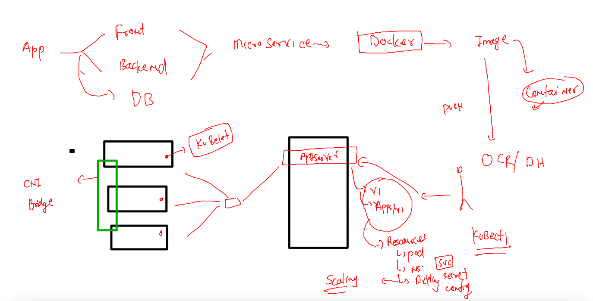
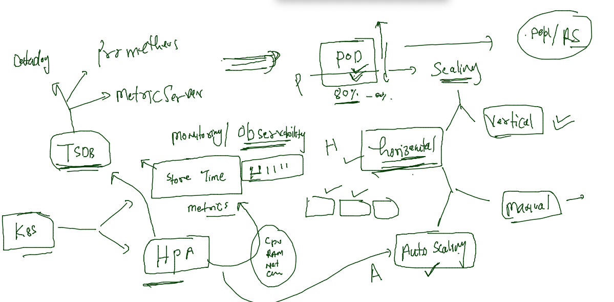
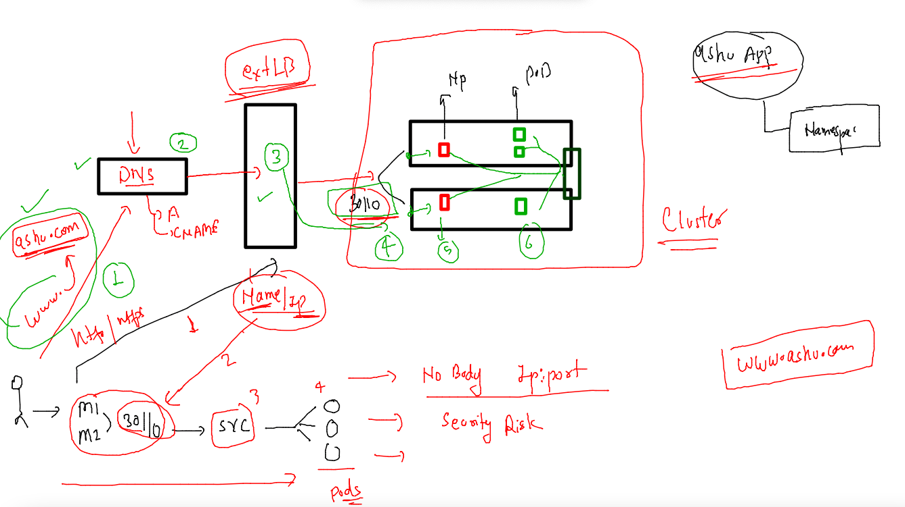
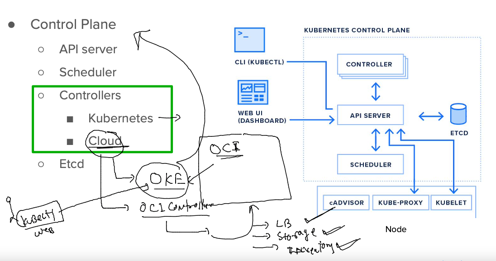
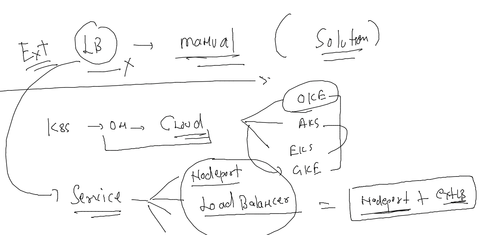
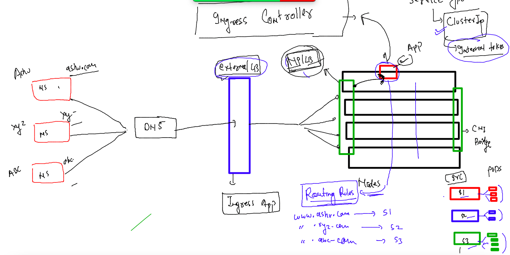

## Training plan 


### Revision 



### last day application --deployed 


### cross checking above details 

```
[ashu@docker-server ocr-deploy]$ kubectl  config get-contexts 
CURRENT   NAME                          CLUSTER      AUTHINFO           NAMESPACE
*         kubernetes-admin@kubernetes   kubernetes   kubernetes-admin   ashu-apps
[ashu@docker-server ocr-deploy]$ 

===========

[ashu@docker-server ocr-deploy]$ kubectl  get  deploy
NAME         READY   UP-TO-DATE   AVAILABLE   AGE
ashuwebapp   1/1     1            1           16h
[ashu@docker-server ocr-deploy]$ kubectl  get  rs
NAME                   DESIRED   CURRENT   READY   AGE
ashuwebapp-878648554   1         1         1       16h
[ashu@docker-server ocr-deploy]$ kubectl  get  po
NAME                         READY   STATUS    RESTARTS      AGE
ashuwebapp-878648554-k8tnp   1/1     Running   1 (60m ago)   16h
[ashu@docker-server ocr-deploy]$ 


=====

[ashu@docker-server ocr-deploy]$ ls
app_deploy.yaml  app_secret.yaml  app_svc.yaml  configmap.yaml
[ashu@docker-server ocr-deploy]$ kubectl get cm 
NAME               DATA   AGE
ashucm             1      17h
kube-root-ca.crt   1      41h
[ashu@docker-server ocr-deploy]$ kubectl get secret
NAME          TYPE                             DATA   AGE
ashu-sec      kubernetes.io/dockerconfigjson   1      41h
ashuapp-sec   kubernetes.io/dockerconfigjson   1      17h

=====

[ashu@docker-server ocr-deploy]$ kubectl  get  svc
NAME      TYPE       CLUSTER-IP     EXTERNAL-IP   PORT(S)          AGE
ashulb3   NodePort   10.101.202.0   <none>        1234:30110/TCP   17h
[ashu@docker-server ocr-deploy]$ 

```

### HPA in k8s 



### creating hpa for deployment 

```
kubectl autoscale deployment ashuwebapp --min=3  --max=20    --cpu-percent 70  --dry-run=client  -o yaml  >hpa.yaml 
```

### checking it 

```
[ashu@docker-server ocr-deploy]$ kubectl apply -f hpa.yaml 
horizontalpodautoscaler.autoscaling/ashuwebapp created
[ashu@docker-server ocr-deploy]$ kubectl  get deploy 
NAME         READY   UP-TO-DATE   AVAILABLE   AGE
ashuwebapp   1/1     1            1           17h
[ashu@docker-server ocr-deploy]$ kubectl  get deploy 
NAME         READY   UP-TO-DATE   AVAILABLE   AGE
ashuwebapp   1/1     1            1           17h
[ashu@docker-server ocr-deploy]$ kubectl  get po
NAME                         READY   STATUS    RESTARTS       AGE
ashuwebapp-878648554-k8tnp   1/1     Running   1 (102m ago)   17h
[ashu@docker-server ocr-deploy]$ kubectl  get  hpa
NAME         REFERENCE               TARGETS         MINPODS   MAXPODS   REPLICAS   AGE
ashuwebapp   Deployment/ashuwebapp   <unknown>/70%   3         20        1          22s
[ashu@docker-server ocr-deploy]$ kubectl  get  hpa
NAME         REFERENCE               TARGETS         MINPODS   MAXPODS   REPLICAS   AGE
ashuwebapp   Deployment/ashuwebapp   <unknown>/70%   3         20        3          40s
[ashu@docker-server ocr-deploy]$ 

```
### for HPA -- we should restrict pod veritical scaling 

```
apiVersion: apps/v1
kind: Deployment
metadata:
  creationTimestamp: null
  labels:
    app: ashuwebapp
  name: ashuwebapp # name of deployment 
spec:
  replicas: 1
  selector:
    matchLabels:
      app: ashuwebapp
  strategy: {}
  template: # for pod creation 
    metadata:
      creationTimestamp: null
      labels:
        app: ashuwebapp
    spec:
      imagePullSecrets: # calling secret to pull image 
      - name: ashuapp-sec # name of secret used by kubelet on minion side 
      containers:
      - image: phx.ocir.io/axmbtg8judkl/ashucustomer:v2
        name: ashucustomer
        ports:
        - containerPort: 80
        env: # calling / using env data 
        - name: deploy # from dockerfile name of env 
          valueFrom: # reading value from somewhere 
            configMapKeyRef:
              name: ashucm # name of configmap 
              key: key1 # key of cm 
        resources: # limiting vertical scaling in PODs
          requests:
            cpu: 100m # 1vcpu == 1000 milicore 
            memory: 200M
          limits: 
            cpu: 300m
            memory: 500M 
status: {}

```
### end to end app trace



### Cloud controller in k8s 



### loadbalancer service 



### loadbalancer service in OKE --

```
learntechb@cloudshell:~ (us-phoenix-1)$ cat /etc/os-release 
NAME="Oracle Linux Server"
learntechb@cloudshell:~ (us-phoenix-1)$ kubectl get deploy 
NAME   READY   UP-TO-DATE   AVAILABLE   AGE
d1     1/1     1            1           50s
learntechb@cloudshell:~ (us-phoenix-1)$ kubectl expose deploy d1 --type NodePort --port 80 --name lb1
service/lb1 exposed
learntechb@cloudshell:~ (us-phoenix-1)$ kubectl get svc
NAME         TYPE        CLUSTER-IP     EXTERNAL-IP   PORT(S)        AGE
kubernetes   ClusterIP   10.96.0.1      <none>        443/TCP        14m
lb1          NodePort    10.96.35.113   <none>        80:30588/TCP   6s
learntechb@cloudshell:~ (us-phoenix-1)$ kubectl expose deploy d1 --type LoadBalancer  --port 80 --name lb2
service/lb2 exposed
learntechb@cloudshell:~ (us-phoenix-1)$ kubectl get svc
NAME         TYPE           CLUSTER-IP      EXTERNAL-IP   PORT(S)        AGE
kubernetes   ClusterIP      10.96.0.1       <none>        443/TCP        14m
lb1          NodePort       10.96.35.113    <none>        80:30588/TCP   50s
lb2          LoadBalancer   10.96.142.195   <pending>     80:31724/TCP   18s
learntechb@cloudshell:~ (us-phoenix-1)$ kubectl get svc
NAME         TYPE           CLUSTER-IP      EXTERNAL-IP      PORT(S)        AGE
kubernetes   ClusterIP      10.96.0.1       <none>           443/TCP        15m
lb1          NodePort       10.96.35.113    <none>           80:30588/TCP   104s
lb2          LoadBalancer   10.96.142.195   129.153.111.84   80:31724/TCP   72s
learntechb@cloudshell:~ (us-phoenix-1)$ 


```

### deploy dashboard in OKE --

```
kubectl apply -f https://raw.githubusercontent.com/kubernetes/dashboard/v2.5.0/aio/deploy/recommended.yaml
```

###

```
learntechb@cloudshell:~ (us-phoenix-1)$ kubectl apply -f https://raw.githubusercontent.com/kubernetes/dashboard/v2.5.0/aio/deploy/recommended.yaml
namespace/kubernetes-dashboard created
serviceaccount/kubernetes-dashboard created
service/kubernetes-dashboard created
secret/kubernetes-dashboard-certs created
secret/kubernetes-dashboard-csrf created
secret/kubernetes-dashboard-key-holder created
configmap/kubernetes-dashboard-settings created
role.rbac.authorization.k8s.io/kubernetes-dashboard created
clusterrole.rbac.authorization.k8s.io/kubernetes-dashboard created
rolebinding.rbac.authorization.k8s.io/kubernetes-dashboard created
clusterrolebinding.rbac.authorization.k8s.io/kubernetes-dashboard created
deployment.apps/kubernetes-dashboard created
service/dashboard-metrics-scraper created
deployment.apps/dashboard-metrics-scraper created
learntechb@cloudshell:~ (us-phoenix-1)$ kubectl get ns
NAME                   STATUS   AGE
default                Active   22m
kube-node-lease        Active   22m
kube-public            Active   22m
kube-system            Active   22m
kubernetes-dashboard   Active   7s
learntechb@cloudshell:~ (us-phoenix-1)$ 
```

### 

```
 522  kubectl -n kubernetes-dashboard  edit svc kubernetes-dashboard
  523  kubectl -n kubernetes-dashboard  get  svc kubernetes-dashboard  -o yaml >svcback.yaml 
learntechb@cloudshell:~ (us-phoenix-1)$ 
learntechb@cloudshell:~ (us-phoenix-1)$ 
learntechb@cloudshell:~ (us-phoenix-1)$ 
learntechb@cloudshell:~ (us-phoenix-1)$ kubectl get ns
NAME                   STATUS   AGE
default                Active   22m
kube-node-lease        Active   22m
kube-public            Active   22m
kube-system            Active   22m
kubernetes-dashboard   Active   30s
learntechb@cloudshell:~ (us-phoenix-1)$ kubectl get deploy -n kubernetes-dashboard
NAME                        READY   UP-TO-DATE   AVAILABLE   AGE
dashboard-metrics-scraper   1/1     1            1           43s
kubernetes-dashboard        1/1     1            1           43s
learntechb@cloudshell:~ (us-phoenix-1)$ kubectl get po  -n kubernetes-dashboard

learntechb@cloudshell:~ (us-phoenix-1)$ kubectl describe  secret kubernetes-dashboard-token-wz548   -n kubernetes-dashboard
Name:         kubernetes-dashboard-token-wz548
Namespace:    kubernetes-dashboard
Labels:       <none>
Annotations:  kubernetes.io/service-account.name: kubernetes-dashboard
              kubernetes.io/service-account.uid: d5667042-5b4d-4798-a431-352f4516572f

Type:  kubernetes.io/service-account-token

Data
====
ca.crt:     1285 bytes
namespace:  20 bytes
token:      eyJhbGciOiJSUzI1NiIsImtpZCI6InVldjJ1LUxZYnhETDdrQlY4SzlBN3hOQURuaUdXU3VkSmgyU2hWMFItQ0EifQ.eyJpc3MiOiJrdWJlcm5ldGVzL3NlcnZpY2VhY2NvdW50Iiwia3ViZXJuZXRlcy5pby9zZXJ2aWNlYWNjb3VudC9uYW1lc3BhY2UiOiJrdWJlcm5ldGVzLWRhc2hib2FyZCIsImt1YmVybmV0ZXMuaW8vc2VydmljZWFjY291bnQvc2VjcmV0Lm5hbWUiOiJrdWJlcm5ldGVzLWRhc2hib2FyZC10b2tlbi13ejU0OCIsImt1YmVybmV0ZXMuaW8vc2VydmljZWFjY291bnQvc2VydmljZS1hY2NvdW50Lm5hbWUiOiJrdWJlcm5ldGVzLWRhc2hib2FyZCIsImt1YmVybmV0ZXMuaW8vc2VydmljZWFjY291bnQvc2VydmljZS1hY2NvdW50LnVpZCI6ImQ1NjY3MDQyLTViNGQtNDc5OC1hNDMxLTM1MmY0NTE2NTcyZiIsInN1YiI6InN5c3RlbTpzZXJ2aWNlYWNjb3VudDprdWJlcm5ldGVzLWRhc2hib2FyZDprdWJlcm5ldGVzLWRhc2hib2FyZCJ9.jv5qrS2AGHbFCnEvvoAJ0PS1UMX362n7sxpDqj9IAORAPTUSx_u8UQp7XrO4fOKttanOc1YyknVmSBWQtuW0a4lK2GG6UxAkdYtoxoqsKTYf82qC42tUUi6l0bty4vCu6KrB7GUg8_AwwClHbkifGyiG8n8Wci-P38RZzGRPsCw7SWZ0rgwCuMMBdOKFIchHs3lWYEeiJUC0lSJVkMI__WpXaj75Xas2TIihZnQ3Bv27BnNT9tNQX_AQiTFPqrhKGVnAB7lFZyfMNqPIysQN25RtDCYzQzciDC0yYYjs2ap3lkwjYDEe_in9d-tJX5b7FWsRi7jGoEaG-Nhnfs9laQ
learntechb@cloudshell:~ (us-phoenix-1)$ 
learntechb@cloudshell:~ (us-phoenix-1)$ 
learntechb@cloudshell:~ (us-phoenix-1)$ kubectl create clusterrolebinding bind1 --clusterrole=cluster-admin --serviceaccount=kubernetes-dashboard:kubernetes-dashboard 
clusterrolebinding.rbac.authorization.k8s.io/bind1 created
learntechb@cloudshell:~ (us-phoenix-1)$ 


```

###  Ingress controller 



### we are going with Nginx ingress controller 

```
kubectl apply -f https://raw.githubusercontent.com/kubernetes/ingress-nginx/controller-v1.2.1/deploy/static/provider/baremetal/deploy.yaml
namespace/ingress-nginx created
serviceaccount/ingress-nginx created
serviceaccount/ingress-nginx-admission created
role.rbac.authorization.k8s.io/ingress-nginx created
role.rbac.authorization.k8s.io/ingress-nginx-admission created
clusterrole.rbac.authorization.k8s.io/ingress-nginx created
clusterrole.rbac.authorization.k8s.io/ingress-nginx-admission created
rolebinding.rbac.authorization.k8s.io/ingress-nginx created
rolebinding.rbac.authorization.k8s.io/ingress-nginx-admission created
clusterrolebinding.rbac.authorization.k8s.io/ingress-nginx created
clusterrolebinding.rbac.authorization.k8s.io/ingress-nginx-admission created
configmap/ingress-nginx-controller created
service/ingress-nginx-controller created
service/ingress-nginx-controller-admission created
deployment.apps/ingress-nginx-controller created
job.batch/ingress-nginx-admission-create created
job.batch/ingress-nginx-admission-patch created
ingressclass.networking.k8s.io/nginx created
validatingwebhookconfiguration.admissionregistration.k8s.io/ingress-nginx-admission created
[ashu@docker-server ocr-deploy]$ 
```

### creating cluster IP service to application 

```

[ashu@docker-server ocr-deploy]$ kubectl  get  deploy 
NAME         READY   UP-TO-DATE   AVAILABLE   AGE
ashuwebapp   3/3     3            3           21h
[ashu@docker-server ocr-deploy]$ kubectl  expose deploy  ashuwebapp  --type ClusterIP --port 1234 --target-port 80   --name  ashu-local-lb --dry-run=client -o yaml >clusterip.svc
[ashu@docker-server ocr-deploy]$ kubectl apply -f clusterip.svc 
service/ashu-local-lb created
[ashu@docker-server ocr-deploy]$ kubectl  get  vc
error: the server doesn't have a resource type "vc"
[ashu@docker-server ocr-deploy]$ kubectl  get  svc
NAME            TYPE        CLUSTER-IP     EXTERNAL-IP   PORT(S)    AGE
ashu-local-lb   ClusterIP   10.97.90.103   <none>        1234/TCP   7s


```
### ingress yaml 

```
apiVersion: networking.k8s.io/v1
kind: Ingress
metadata:
  name: ashu-app-routing-rule # name of rule 
  annotations:
    nginx.ingress.kubernetes.io/rewrite-target: /
spec:
  ingressClassName: nginx # nginx ingress 
  rules:
  - host: www.ashu.com
    http:
      paths:
      - path: /
        pathType: Prefix
        backend:
          service:
            name: ashu-local-lb
            port:
              number: 80
```

### ingress rules 

```
ashu@docker-server ocr-deploy]$ kubectl  get  ingress
NAME                    CLASS   HOSTS          ADDRESS        PORTS   AGE
ashu-app-routing-rule   nginx   www.ashu.com   172.31.16.37   80      6m32s
[ashu@docker-server ocr-deploy]$ 
```


