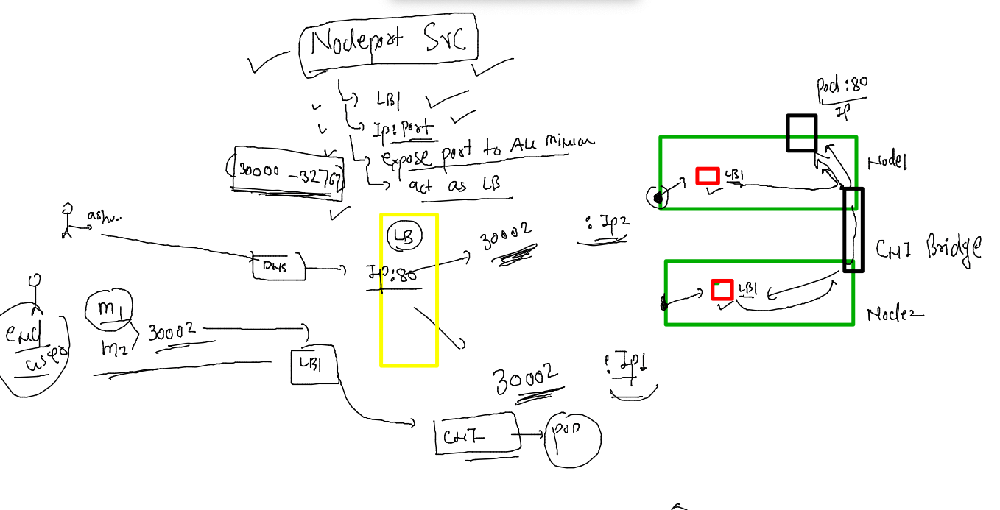

## Training plan 


### webapps in single docker image 


### app clone 

```
384  git clone https://github.com/microsoft/project-html-website.git
  385  git clone https://github.com/schoolofdevops/html-sample-app.git
```

### Dockerfile 

```
FROM oraclelinux:8.4
LABEL name=ashutoshh
ENV deploy=webapp 
RUN yum install httpd -y ; mkdir -p /common/{app1,app2}
COPY html-sample-app /common/app1/
ADD  project-html-website  /common/app2/
COPY deploy.sh /common/
WORKDIR /common
RUN chmod +x deploy.sh
ENTRYPOINT  ["./deploy.sh"] 
#CMD ["./deploy.sh"]
# CMD is to define default process for container 


```

### .dockerignore 

```
html-sample-app/.git
html-sample-app/*.txt
project-html-website/.git
project-html-website/LICENSE
project-html-website/README.md

```

### shell script as container parent process 

```
#!/bin/bash

if  [  "$deploy" ==  "webapp1"  ]
then
    cp -rf /common/app1/*  /var/www/html/
    httpd -DFOREGROUND 
elif [  "$deploy" ==  "webapp2"  ]
then
    cp -rf /common/app2/*  /var/www/html/
    httpd -DFOREGROUND 
else 
    echo "You need to check Env variable value .." >/var/www/html/index.html
    httpd -DFOREGROUND
fi 
```

### docker compose 

```
version: "3.8"
services:
  ashuapp1:
    image: ashucustomer:v1
    build: .
    container_name: ashuc1
    ports:
    - "1234:80"
    environment:
      deploy: webapp2
    restart: always 
```

### running compose 

```
[ashu@docker-server ashu_customer1]$ ls
deploy.sh  docker-compose.yaml  Dockerfile  html-sample-app  project-html-website
[ashu@docker-server ashu_customer1]$ docker-compose up -d --build 
[+] Building 57.4s (12/12) FINISHED                                                              
 => [internal] load build definition from Dockerfile                                        0.0s
 => => transferring dockerfile: 485B                                                        0.0s
 => [internal] load .dockerignore                                                           0.0s
 => => transferring context: 230B                                                           0.0s
 => [internal] load metadata for docker.io/library/oraclelinux:8.4                          1.2s
 => [1/7] FROM docker.io/library/oraclelinux:8.4@sha256:b81d5b0638bb67030b207d28586d0e714a  6.4s
 => => resolve docker.io/library/oraclelinux:8.4@sha256:b81d5b0638bb67030b207d28586d0e714a  0.0s
 => => sha256:b81d5b0638bb67030b207d28586d0e714a811cc612396dbe3410db406998b3ad 547B / 547B  0.0s
 => => sha256:ef0327c1a51e3471e9c2966b26b6245bd1f4c3f7c86d7edfb47a39adb446ceb5 529B / 529B  0.0s
 => => sha256:97e22ab49eea70a5d500e00980537605d56f30f9614b3a6d6c4ae9ddbd64 1.48kB / 1.48kB  0.0s
 => => sha256:a4df6f21af842935f0b80f5f255a88caf5f16b86e2642b468f83b89766 90.36MB / 90.36MB  2.4s
 => => extracting sha256:a4df6f21af842935f0b80f5f255a88caf5f16b86e2642b468f83b8976666c3d7   3.7s
 => [internal] load build context                                                           0.0s
 => => transferring context: 2.88MB                                                         0.0s
 => [2/7] RUN yum install httpd -y ; mkdir -p /common/{app1,app2}                          43.0s
 => [3/7] COPY html-sample-app /common/app1/                                                0.5s 
 => [4/7] ADD  project-html-website  /common/app2/                                          0.1s 
 => [5/7] COPY deploy.sh /common/                                                           0.2s 
 => [6/7] WORKDIR /common                                                                   0.0s 
 => [7/7] RUN chmod +x deploy.sh                                                            2.0s 
 => exporting to image                                                                      4.0s
 => => exporting layers                                                                     4.0s
 => => writing image sha256:e90ac2045e84854258012f3ab46630ed8552923231d0d1c4e3441185c2299e  0.0s
 => => naming to docker.io/library/ashucustomer:v1                                          0.0s
[+] Running 2/2
 ⠿ Network ashu_customer1_default  Created                                                  0.6s
 ⠿ Container ashuc1                Started
```

### k8s for pod YAML 

```
kubectl run  ashucustomerpod --image=docker.io/dockerashu/ashucustomer:v1  --port 80   --dry-run=client -o yaml  >customer.yaml
```

### final YAML for webapp2 


### deploy YAML 

```
[ashu@docker-server k8s_app_deploy]$ kubectl apply -f  customer.yaml 
pod/ashucustomerpod created
[ashu@docker-server k8s_app_deploy]$ kubectl  get  po 
NAME              READY   STATUS              RESTARTS   AGE
ashucustomerpod   0/1     ContainerCreating   0          3s
[ashu@docker-server k8s_app_deploy]$ kubectl  get  po 
NAME              READY   STATUS    RESTARTS   AGE
ashucustomerpod   1/1     Running   0          14s
[ashu@docker-server k8s_app_deploy]$ kubectl  get  po -o wide
NAME              READY   STATUS    RESTARTS   AGE   IP                NODE    NOMINATED NODE   READINESS GATES
ashucustomerpod   1/1     Running   0          20s   192.168.166.183   node1   <none>           <none>
[ashu@docker-server k8s_app_deploy]$ 


```

### networking in k8s 


### container networking models 


### checking pod ip and CNI details 


### pod ipaddress usage number 1 

```
[ashu@docker-server k8s_app_deploy]$ kubectl  get  po -o wide
NAME              READY   STATUS    RESTARTS   AGE   IP                NODE    NOMINATED NODE   READINESS GATES
ashucustomerpod   1/1     Running   0          22m   192.168.166.183   node1   <none>           <none>
[ashu@docker-server k8s_app_deploy]$ kubectl  run nettest --image=alpine --command sleep 10000 
pod/nettest created
[ashu@docker-server k8s_app_deploy]$ kubectl  get po -o wide
NAME              READY   STATUS    RESTARTS   AGE   IP                NODE    NOMINATED NODE   READINESS GATES
ashucustomerpod   1/1     Running   0          23m   192.168.166.183   node1   <none>           <none>
nettest           1/1     Running   0          5s    192.168.104.50    node2   <none>           <none>
[ashu@docker-server k8s_app_deploy]$ kubectl  exec -it nettest -- sh 
/ # ping 192.168.166.183
PING 192.168.166.183 (192.168.166.183): 56 data bytes
64 bytes from 192.168.166.183: seq=0 ttl=62 time=0.533 ms
64 bytes from 192.168.166.183: seq=1 ttl=62 time=0.361 ms
^C
--- 192.168.166.183 ping statistics ---
2 packets transmitted, 2 packets received, 0% packet loss
round-trip min/avg/max = 0.361/0.447/0.533 ms
/ # exit
```

### network model 


### enduser to pod traffic 


### for Internal ks8 LBs we need serivce resources in k8s 


### type of service 


### Nodeport service 


### explained nodeport



### creating nodeport serive YAML 

```
[ashu@docker-server images]$ kubectl create  service 
Create a service using a specified subcommand.

Aliases:
service, svc

Available Commands:
  clusterip      Create a ClusterIP service
  externalname   Create an ExternalName service
  loadbalancer   Create a LoadBalancer service
  nodeport       Create a NodePort service
  
  kubectl create  service  nodeport   ashulb1 --tcp  1234:80 --dry-run=client -o yaml      >customersvc_nodeport.yaml
```


### YAML VIew 

```
apiVersion: v1
kind: Service
metadata:
  creationTimestamp: null
  labels:
    app: ashulb1
  name: ashulb1 # name of my internal lb / service 
spec:
  ports:
  - name: 1234-80
    port: 1234 # internal LB port number 
    protocol: TCP
    targetPort: 80 # app port which is running inside POD 
  selector:
    app: ashulb1
  type: NodePort # type of service 
status:
  loadBalancer: {}

```

### deploy it 

```
[ashu@docker-server k8s_app_deploy]$ kubectl  apply -f  customersvc_nodeport.yaml 
service/ashulb1 created
[ashu@docker-server k8s_app_deploy]$ kubectl  get  po 
NAME              READY   STATUS    RESTARTS   AGE
ashucustomerpod   1/1     Running   0          128m
[ashu@docker-server k8s_app_deploy]$ kubectl  get  service 
NAME      TYPE       CLUSTER-IP       EXTERNAL-IP   PORT(S)          AGE
ashulb1   NodePort   10.103.173.166   <none>        1234:30608/TCP   10s
[ashu@docker-server k8s_app_deploy]$ 


```

### checking label of pods

```
[ashu@docker-server k8s_app_deploy]$ kubectl  get po --show-labels 
NAME              READY   STATUS    RESTARTS   AGE    LABELS
ashucustomerpod   1/1     Running   0          138m   run=ashucustomerpod
[ashu@docker-server k8s_app_deploy]$ 

```

### changing label apply and check EP 

```
[ashu@docker-server k8s_app_deploy]$ kubectl apply -f  customersvc_nodeport.yaml 
service/ashulb1 configured
[ashu@docker-server k8s_app_deploy]$ kubectl  get svc -o wide
NAME      TYPE       CLUSTER-IP       EXTERNAL-IP   PORT(S)          AGE   SELECTOR
ashulb1   NodePort   10.103.173.166   <none>        1234:30608/TCP   13m   run=ashucustomerpod
[ashu@docker-server k8s_app_deploy]$ kubectl  get ep 
NAME      ENDPOINTS            AGE
ashulb1   192.168.166.183:80   13m
[ashu@docker-server k8s_app_deploy]$ kubectl  get po -o wide
NAME              READY   STATUS    RESTARTS   AGE    IP                NODE    NOMINATED NODE   READINESS GATES
ashucustomerpod   1/1     Running   0          142m   192.168.166.183   node1   <none>           <none>
[ashu@docker-server k8s_app_deploy]$ 
```

### problems with POD 


### to solve problems of POd -- 


### introduction to Deployment controller in k8s


### creating deployment 

```
kubectl create deployment  ashuapp1 --image=docker.io/dockerashu/ashucustomer:v1   --port 80 --dry-run=client -o yaml 
```

### Understanding yaml 


### yaml 

```
apiVersion: apps/v1
kind: Deployment
metadata:
  creationTimestamp: null
  labels:
    app: ashuapp1
  name: ashuapp1 # name of deployment 
spec:
  replicas: 1 # number of pod that will be maintained 
  selector:
    matchLabels:
      app: ashuapp1
  strategy: {}
  template: # deploy will use template to create pods 
    metadata:
      creationTimestamp: null
      labels: # label of all my pods by this deployment 
        app: ashuapp1
    spec:
      containers:
      - image: docker.io/dockerashu/ashucustomer:v1
        name: ashucustomer
        ports:
        - containerPort: 80
        env: # adding env in deployment 
        - name: deploy
          value: webapp1 
        resources: {}
status: {}

```

### Deploy it 

```
ashu@docker-server k8s_app_deploy]$ kubectl apply -f deployment.yaml 
deployment.apps/ashuapp1 created
[ashu@docker-server k8s_app_deploy]$ kubectl  get deployment 
NAME       READY   UP-TO-DATE   AVAILABLE   AGE
ashuapp1   1/1     1            1           6s
[ashu@docker-server k8s_app_deploy]$ kubectl  get po
NAME                        READY   STATUS    RESTARTS   AGE
ashuapp1-746b946445-hjp65   1/1     Running   0          19s
[ashu@docker-server k8s_app_deploy]$ kubectl  get po -o wide
NAME                        READY   STATUS    RESTARTS   AGE   IP                NODE    NOMINATED NODE   READINESS GATES
ashuapp1-746b946445-hjp65   1/1     Running   0          30s   192.168.166.136   node1   <none>           <none>
[ashu@docker-server k8s_app_deploy]$ 
```

### deployment will recreate pod 

```
kubectl  get  po 
NAME                        READY   STATUS    RESTARTS   AGE
ashuapp1-746b946445-hjp65   1/1     Running   0          2m45s
[ashu@docker-server k8s_app_deploy]$ kubectl delete pod ashuapp1-746b946445-hjp65 
pod "ashuapp1-746b946445-hjp65" deleted
[ashu@docker-server k8s_app_deploy]$ kubectl  get  po 
NAME                        READY   STATUS    RESTARTS   AGE
ashuapp1-746b946445-d9w9q   1/1     Running   0          42s
[ashu@docker-server k8s_app_deploy]$ 
```

### scaling pod horizentally -- 

```
[ashu@docker-server k8s_app_deploy]$ kubectl  scale deployment  ashuapp1  --replicas=3
deployment.apps/ashuapp1 scaled
[ashu@docker-server k8s_app_deploy]$ kubectl  get po -o wide
NAME                        READY   STATUS              RESTARTS   AGE     IP                NODE    NOMINATED NODE   READINESS GATES
ashuapp1-746b946445-d9w9q   1/1     Running             0          4m52s   192.168.166.133   node1   <none>           <none>
ashuapp1-746b946445-f5dsx   0/1     ContainerCreating   0          2s      <none>            node2   <none>           <none>
ashuapp1-746b946445-f5w29   1/1     Running             0          2s      192.168.166.142   node1   <none>           <none>
[ashu@docker-server k8s_app_deploy]$ kubectl  get po -o wide
NAME                        READY   STATUS    RESTARTS   AGE   IP                NODE    NOMINATED NODE   READINESS GATES
ashuapp1-746b946445-d9w9q   1/1     Running   0          5m    192.168.166.133   node1   <none>           <none>
ashuapp1-746b946445-f5dsx   1/1     Running   0          10s   192.168.104.63    node2   <none>           <none>
ashuapp1-746b946445-f5w29   1/1     Running   0          10s   192.168.166.142   node1   <none>           <none>
[ashu@docker-server k8s_app_deploy]$ kubectl  get deployment 
NAME       READY   UP-TO-DATE   AVAILABLE   AGE
ashuapp1   3/3     3            3           8m16s
```


