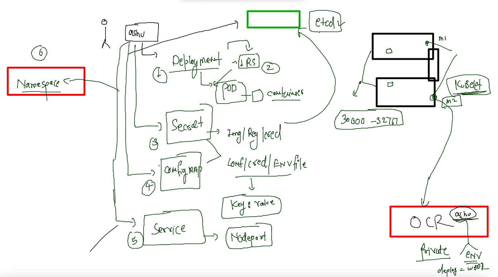

## Training plan 


### Revision 


### last day application --deployed 



### cross checking above details 

```
[ashu@docker-server ocr-deploy]$ kubectl  config get-contexts 
CURRENT   NAME                          CLUSTER      AUTHINFO           NAMESPACE
*         kubernetes-admin@kubernetes   kubernetes   kubernetes-admin   ashu-apps
[ashu@docker-server ocr-deploy]$ 

===========

[ashu@docker-server ocr-deploy]$ kubectl  get  deploy
NAME         READY   UP-TO-DATE   AVAILABLE   AGE
ashuwebapp   1/1     1            1           16h
[ashu@docker-server ocr-deploy]$ kubectl  get  rs
NAME                   DESIRED   CURRENT   READY   AGE
ashuwebapp-878648554   1         1         1       16h
[ashu@docker-server ocr-deploy]$ kubectl  get  po
NAME                         READY   STATUS    RESTARTS      AGE
ashuwebapp-878648554-k8tnp   1/1     Running   1 (60m ago)   16h
[ashu@docker-server ocr-deploy]$ 


=====

[ashu@docker-server ocr-deploy]$ ls
app_deploy.yaml  app_secret.yaml  app_svc.yaml  configmap.yaml
[ashu@docker-server ocr-deploy]$ kubectl get cm 
NAME               DATA   AGE
ashucm             1      17h
kube-root-ca.crt   1      41h
[ashu@docker-server ocr-deploy]$ kubectl get secret
NAME          TYPE                             DATA   AGE
ashu-sec      kubernetes.io/dockerconfigjson   1      41h
ashuapp-sec   kubernetes.io/dockerconfigjson   1      17h

=====

[ashu@docker-server ocr-deploy]$ kubectl  get  svc
NAME      TYPE       CLUSTER-IP     EXTERNAL-IP   PORT(S)          AGE
ashulb3   NodePort   10.101.202.0   <none>        1234:30110/TCP   17h
[ashu@docker-server ocr-deploy]$ 

```

